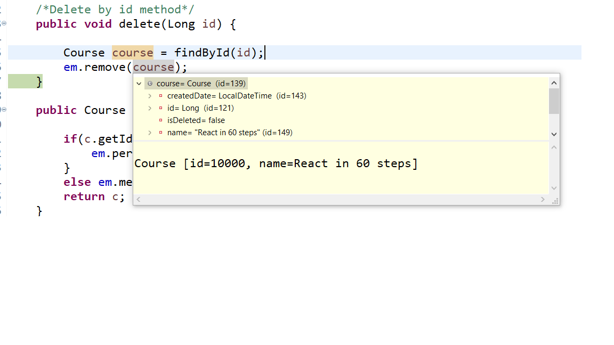

## Hibernate and JPA tips

**Hibernate soft Deletes**


Part 1
---
It keeps history of what row has been deleted. As every row is an object mapped to db table.

Lets take example of ``Course.java``

Add field ``private boolean isDeleted`` in it. It will be ``true`` if row is deleted or ``false`` if row is not deleted.

Add ``is_deleted`` as column and ``false`` as value to ``course`` table in ``data.sql`` as well else it will through ``null`` error while inserting.

We will use hibernate specific annotation ``@SQLDelete`` , its not JPA annotation.

```java

@Entity
@NamedQuery(name = "find_all_courses", query = "select c from Course c")
@SQLDelete(sql = "update course set is_deleted =true where id ?")
public class Course {
	@Id
	@GeneratedValue
	private Long id;
	private String name;
	....
	}
```
But Below test will still fetch course with deleted id (as the row is still present, but is_deleted column value is true but getById() doesn't know that)

```java
	@Test
	@DirtiesContext
	void deleteCourse(){
		try {
			repository.delete(10000L);
			assertNull(repository.findById(10000L)); // it will still fetch result
		} catch (Exception e) {
			assertFalse(true);
		}
	}
```
To avoid above we can use ``@where`` clause

```java
@Entity
@NamedQuery(name = "find_all_courses", query = "select c from Course c")
@SQLDelete(sql = "update course set is_deleted =true where id=?")
@Where(clause = "is_deleted=fasle") // so fetch rows if is_deleted=false
public class Course {
	@Id
	@GeneratedValue
	private Long id;
	private String name;
```
Upon running above test console output is :

```log
Hibernate: update course set is_deleted =true where id=?
2021-10-03 10:23:40.715 TRACE 13416 --- [           main] o.h.type.descriptor.sql.BasicBinder      : binding parameter [1] as [BIGINT] - [10000]
Hibernate: select course0_.id as id1_0_0_, course0_.created_date as created_2_0_0_, course0_.is_deleted as is_delet3_0_0_, course0_.name as name4_0_0_, course0_.updated_date as updated_5_0_0_ from course course0_ where course0_.id=? and ( course0_.is_deleted=0)
```

Part 2
---
If you are using ``NativeQueries`` then you have to manually add ``where is_deleted =0`` for ``course`` table as ``NativeQueries`` don't recognize ``@SQLDelete`` and ``@Where`` clause.

Example update following test like this in your ``NativeQueriesTest.java``

```java
	@Test
	void native_query_basic() {
		Query q  = manager.createNativeQuery("select * from course where is_deleted = 0",Course.class);
		List resultList = q.getResultList();
		logger.info("select * from course : -> {}",resultList);
	}
	
```

**Important : **
When deleteById(Long id) is called first findById(id) is called as we can see in ``CourseRepository.java``

```java
/*Delete by id method*/
	public void delete(Long id) {
		em.remove(findById(id)); //findById return COurse Obj from table row
	}
```
then ``em.remove(course)`` is called , here hibernate sets ``is_deleted= true`` as we have mentioned in ``@SQLDelete`` annotation.

But attribute value isDeleted is still false, which is a problem. Because hibernate has no way of knowing that isDeleted field is being set as it just appends the query from ``@SQLDelete``.



As we can see even after removing the row from db (after setting ``is_deleted=true``), ``isDeleted`` field has ``false`` value, which should be avoided.

Hence to avoid this  we can use ``@PreRemove`` life cycle hook of JPA

Add following to your ``Course.java`` class

```java
	@PreRemove
	void beforeRemove() {
		
		LOGGER.info("isDelete is being set to true");
		this.isDeleted=true;
	}
```
This will set the value of ``isDeleted=true`` ,as ``is_deleted`` will be set to true in db table of ``course``

****

JPA Life Cycle Hooks or Methods
---
``PreRemove``,``postLoad``,``PreUpdate``,``PrePersist``,``PostUpdate``,``PostRemove``,and ``PostPersist``

We have already seen ``preRemove``


