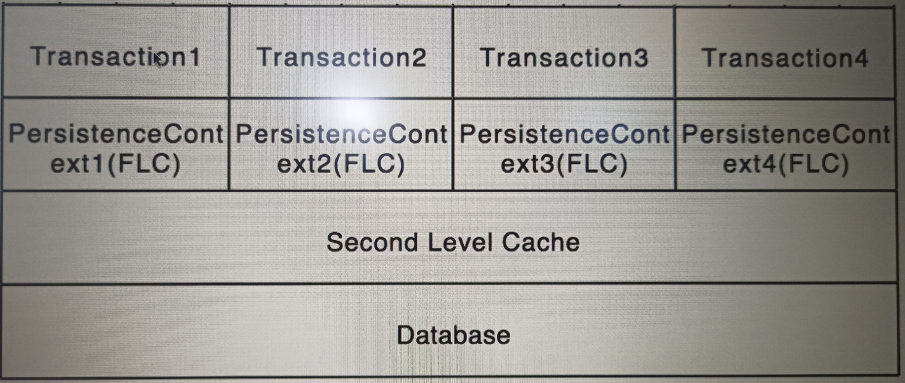

## Introduction to caching

``UI-Web`` <----> ``Service`` <----> ``Data`` <----> ``Database``
----
We can understand by above , that for every request from UI-web data is fetch from Database. 

To reduce the round trip time of every request , data is cached at Data layer(Repository) and served from there if request for same data comes.

When it comes to ``Hibernate`` there are two level of caching

PersistenceContext ----> FirstLevelCache ----> SecondLevelCache ----> Database
----

**First level Cache**

When two or more operation within the same **Transaction** want to access the same data then First level cache comes into picture.

It works in the Context of single transaction.

Running following code from ``CourseRepositoryTest.java``

```java
	@Test
	@Transactional
	void findById_FirstLevelCache() {
		Course course = repository.findById(10002L);
		logger.info("First Course Retrieved {} :",course);
		Course course1 = repository.findById(10002L);
		logger.info("Second Course Retrieved {} :",course1);
		assertEquals("Perseverance in 20 steps",course.getName());
		assertEquals("Perseverance in 20 steps",course1.getName());
	}
```
console-output:

```log
Hibernate: select course0_.id as id1_0_0_, course0_.created_date as created_2_0_0_, course0_.name as name3_0_0_, course0_.updated_date as updated_4_0_0_ from course course0_ where course0_.id=?
2021-10-02 11:23:03.109 TRACE 6188 --- [           main] o.h.type.descriptor.sql.BasicBinder      : binding parameter [1] as [BIGINT] - [10002]
2021-10-02 11:23:03.133 TRACE 6188 --- [           main] o.h.type.descriptor.sql.BasicExtractor   : extracted value ([created_2_0_0_] : [TIMESTAMP]) - [2021-10-02T00:00]
2021-10-02 11:23:03.134 TRACE 6188 --- [           main] o.h.type.descriptor.sql.BasicExtractor   : extracted value ([name3_0_0_] : [VARCHAR]) - [Perseverance in 20 steps]
2021-10-02 11:23:03.135 TRACE 6188 --- [           main] o.h.type.descriptor.sql.BasicExtractor   : extracted value ([updated_4_0_0_] : [TIMESTAMP]) - [2021-10-02T00:00]
2021-10-02 11:23:03.168 TRACE 6188 --- [           main] org.hibernate.type.CollectionType        : Created collection wrapper: [com.prashant.jpa.hibernate.JpaHIbernate.entity.Course.reviews#10002]
2021-10-02 11:23:03.168 TRACE 6188 --- [           main] org.hibernate.type.CollectionType        : Created collection wrapper: [com.prashant.jpa.hibernate.JpaHIbernate.entity.Course.students#10002]
2021-10-02 11:23:03.178  INFO 6188 --- [           main] c.p.j.h.J.r.CourseRepositoryTest         : First Course Retrieved 
Course [id=10002, name=Perseverance in 20 steps] :
2021-10-02 11:23:03.179  INFO 6188 --- [           main] c.p.j.h.J.r.CourseRepositoryTest         : Second Course Retrieved 
Course [id=10002, name=Perseverance in 20 steps]
```
As we can see Select query was fired only once by Hiberanate for ``course``, as the result was cached and returned in the second request for ``course1``.

So, First level cache was active by default


**Second Level Cache**

When operations from different **Transactions** want to access the same data then second level transaction comes into picture.

It works in context of multiple transactions.

Second level cache require configuration.



Second level cache using ``EhCache``

Add following to ``application.properties``

Actually it has been deprecated, I will add something new.

