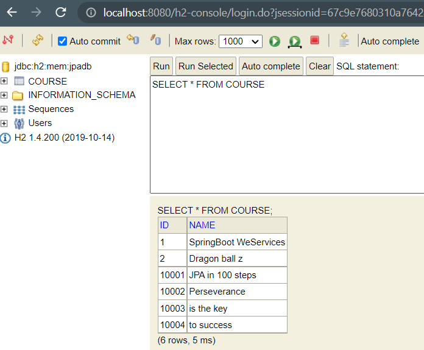
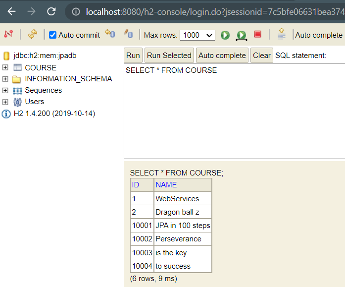
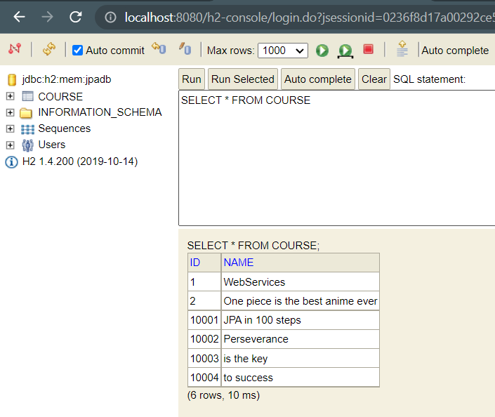

# JPA Hibernate in depth with Junit5 Test cases
### For Unit test cases you can see files in ``src/test/java`` folder <br>

``@DirtiesContext`` in Junit Test classes <br>

```java
	@Test
	@DirtiesContext // after Execution of this test the state will be reverted to prior state i.e deleted data will be
	//restored so that other dependent test cases are not affected.
	 
	void deleteCourse(){
		try {
			repository.delete(10002L);
			assertNull(repository.findById(10002L));
		} catch (Exception e) {
			assertFalse(true);
		}
	}
```

**Let see methods of** ``EntityManager`` for performing various crud operations in ``CourseRepository.java`` <br>


```java
	@Repository
	@Transactional
	public class CourseRepository {
		
		@Autowired
		EntityManager em;
		
		/*Find by id*/
		public Course findById(Long id) {
			return em.find(Course.class, id);
		}
		
		/*Delete by id method*/
		public void delete(Long id) {
			
			em.remove(findById(id));
		}
		
		//For Insert or Update operations
		public Course save(Course c) {
			
			if(c.getId()==null) {
				em.persist(c);    //Insert 
			}
			else em.merge(c);    // Update
			return c;
		}
		
	}
```

###Importance of ``@Transactional`` annotation in Repository. <br>

```java
	@Repository
	@Transactional
	public class CourseRepository {
	....
		public void playWithEntityManager() {
			Course entity = new Course("WebServices");
			em.persist(entity);
			entity.setName("SpringBoot WeServices");
		}
	....
	}
```

Output <br>

```log
Hibernate: call next value for hibernate_sequence
Hibernate: insert into course (name, id) values (?, ?)
Hibernate: update course set name=? where id=?
```
As you can see after executing insert query for ``em.persist(entity)``, update is executed. 
This is beacause ``@Transactional`` ensures that there is atomic execution of operation that is either all or non.

***

## Some Imp Methods of ``EntityManager``


``flush()`` saves the changes till this point to database <br>

```java
	public void playWithEntityManager() {
		Course entity = new Course("WebServices");
		em.persist(entity);
		em.flush(); /*flush() is EntityManager method that upon calling changes are updated to db till that point
		             So, due to 2 flush() method this transaction will have two operations to perform.*/
		
		
		entity.setName("SpringBoot WeServices");
		em.flush();
		
	}
```

``detach(Object)`` If you want to stop tracking the changes of an object as a part of transaction <br>

```java
	public void playWithEntityManager() {
		Course entity = new Course("WebServices");
		em.persist(entity);
		em.flush(); /*flush() is EntityManager method that upon calling changes are updated to db till that point
		             So, due to 2 flush() method this transaction will have two operations to perform.*/
		
		
		entity.setName("SpringBoot WeServices");
		em.flush();
		
		Course course2 = new Course("Dragon ball z ");
		em.persist(course2);
		em.flush();
		
		em.detach(course2); // stop tracking changes to course2 as part of transaction
		course2.setName("One piece is the best anime ever");
		em.flush();
		
	}
```
Console Output

```log
Hibernate: call next value for hibernate_sequence
Hibernate: insert into course (name, id) values (?, ?)
Hibernate: update course set name=? where id=?
Hibernate: call next value for hibernate_sequence
Hibernate: insert into course (name, id) values (?, ?)
```
H2-console : As you can see ``One piece is the best anime ever`` is not updated <br>

 <br>

``clear()`` It is similar to ``detach(Object)`` , but once it is called it will everything that is being tracked by ``EntityManager`` .

```java

	public void playWithEntityManager() {
		Course entity = new Course("WebServices");
		em.persist(entity);
		em.flush(); /*flush() is EntityManager method that upon calling changes are updated to db till that point
		             So, due to 2 flush() method this transaction will have two operations to perform.*/
		
		Course course2 = new Course("Dragon ball z ");
		em.persist(course2);
		em.flush();
		
		em.clear(); // stops tracking changes to course2 and entity both
		course2.setName("One piece is the best anime ever");
		em.flush();
		
		entity.setName("SpringBoot WeServices");
		em.flush();
		
	}

```
Console Output <br>

```log
Hibernate: call next value for hibernate_sequence
Hibernate: insert into course (name, id) values (?, ?)
Hibernate: call next value for hibernate_sequence
Hibernate: insert into course (name, id) values (?, ?)
```
H2-console: As you can see after ``clear()`` changes to ``entity`` and ``course2`` are not updated.

 <br>

``refreash(Object)`` this method makes the object synchronize with the db , that is ``entity`` and ``course2`` will have the same value 
what is stored in the db before ``clear()`` or ``detach()`` is called. See the below code.

```java
	public void playWithEntityManager() {
		Course course1 = new Course("WebServices");
		em.persist(course1);
		Course course2 = new Course("Dragon ball z ");
		em.persist(course2);
		em.flush(); /*flush() is EntityManager method that upon calling changes are updated to db till that point
        So, due to 2 flush() method this transaction will have two operations to perform.*/
		
		course2.setName("One piece is the best anime ever");
		course1.setName("SpringBoot WeServices");
		
		em.refresh(course1); // refreash() updates the respective object to have the same values as the db, which is returned and hibernate select query is executed  
		em.flush();
		
		
	}
```
Console Output 

```log
Hibernate: insert into course (name, id) values (?, ?) //1st flush()
Hibernate: insert into course (name, id) values (?, ?) //2nd flush()
Hibernate: select course0_.id as id1_0_0_, course0_.name as name2_0_0_ from course course0_ where course0_.id=? //refreash() of course1
Hibernate: update course set name=? where id=? // update name of course 2
```
***

h2-console: As you can see ``course2``(id=2) is updated but ``course1``(id=1) is not updated

 <br>