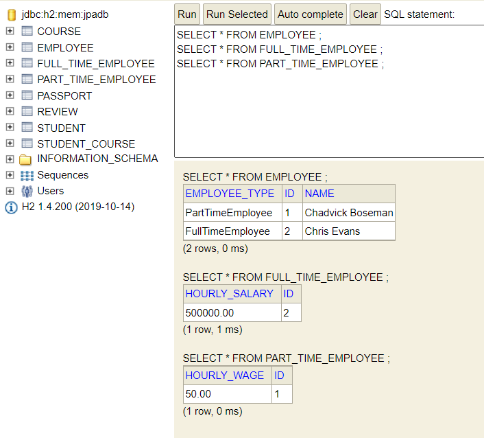

# JPA Inheritance Hierarchies and mapping

Create Entity abstract class ``Employee.java``, ``PartTimeEmployee.java`` extends ``Employee.java``

``Employee.java``

```java
@Entity
public abstract class Employee {
	@Id
	@GeneratedValue
	private Long id;
	@Column(nullable=false)
	private String name;
	
	protected Employee() {}
	
	public Employee(String name) {
		this.name=name;
	}
	
	public String getName() {
		return name;
	}


	public void setName(String name) {
		this.name = name;
	}


	@Override
	public String toString() {
		return "\nCourse [id=" + id + ", name=" + name + "]";
	}
	
	

}
```
``PartTimeEmployee.java``

```java
@Entity
public class PartTimeEmployee extends Employee {
	protected PartTimeEmployee() {

	}

	public PartTimeEmployee(String name, BigDecimal hourlyWage) {
		super(name);
		this.hourlyWage = hourlyWage;

	}

	private BigDecimal hourlyWage;
	}
```
``FullTimeEmployee.java``

```java
@Entity
public class FullTimeEmployee extends Employee {
	protected FullTimeEmployee() {
		
	}
	public FullTimeEmployee(String name, BigDecimal hourlySalary) {
		super(name);
		this.hourlySalary=hourlySalary;
	
		
	}
	
	private BigDecimal hourlySalary;
	}
```

``EmployeeRepository.java``

```java

@Repository
@Transactional
public class EmployeeRepository {
	
	private Logger logger = LoggerFactory.getLogger(this.getClass());
	@Autowired
	EntityManager em;
	
	/*Find by id*/
	public void insert(Employee employee) {
		em.persist(employee);
	}
	public List<Employee> findAllEmployees(){
		return em.createQuery("select e from Employee e",Employee.class).getResultList();
	}
	
	
}
```
Insert following to the ``JpaHibernateApplication.java``'s ``run(String ... args)`` method:

```java
		employeeRepository.insert(new PartTimeEmployee("Chadvick Boseman", new BigDecimal(50)));
		employeeRepository.insert(new FullTimeEmployee("Chris Evans", new BigDecimal(500000)));
		logger.info("All the Employees are -> {}",employeeRepository.findAllEmployees());
```
console-output:

```log
Hibernate: insert into employee (name, hourly_salary, dtype, id) values (?, ?, 'FullTimeEmployee', ?)
2021-09-29 16:34:47.216 TRACE 18752 --- [           main] o.h.type.descriptor.sql.BasicBinder      : binding parameter [1] as [VARCHAR] - [Chris Evans]
2021-09-29 16:34:47.217 TRACE 18752 --- [           main] o.h.type.descriptor.sql.BasicBinder      : binding parameter [2] as [NUMERIC] - [500000]
2021-09-29 16:34:47.217 TRACE 18752 --- [           main] o.h.type.descriptor.sql.BasicBinder      : binding parameter [3] as [BIGINT] - [2]
Hibernate: select employee0_.id as id2_1_, employee0_.name as name3_1_, employee0_.hourly_salary as hourly_s4_1_, employee0_.hourly_wage as hourly_w5_1_, employee0_.dtype as dtype1_1_ from employee employee0_
2021-09-29 16:34:47.261 TRACE 18752 --- [           main] o.h.type.descriptor.sql.BasicExtractor   : extracted value ([id2_1_] : [BIGINT]) - [1]
2021-09-29 16:34:47.263 TRACE 18752 --- [           main] o.h.type.descriptor.sql.BasicExtractor   : extracted value ([dtype1_1_] : [VARCHAR]) - [PartTimeEmployee]
2021-09-29 16:34:47.268 TRACE 18752 --- [           main] o.h.type.descriptor.sql.BasicExtractor   : extracted value ([name3_1_] : [VARCHAR]) - [Chadvick Boseman]
2021-09-29 16:34:47.270 TRACE 18752 --- [           main] o.h.type.descriptor.sql.BasicExtractor   : extracted value ([hourly_w5_1_] : [NUMERIC]) - [50.00]
2021-09-29 16:34:47.271 TRACE 18752 --- [           main] o.h.type.descriptor.sql.BasicExtractor   : extracted value ([id2_1_] : [BIGINT]) - [2]
2021-09-29 16:34:47.272 TRACE 18752 --- [           main] o.h.type.descriptor.sql.BasicExtractor   : extracted value ([dtype1_1_] : [VARCHAR]) - [FullTimeEmployee]
2021-09-29 16:34:47.272 TRACE 18752 --- [           main] o.h.type.descriptor.sql.BasicExtractor   : extracted value ([name3_1_] : [VARCHAR]) - [Chris Evans]
2021-09-29 16:34:47.273 TRACE 18752 --- [           main] o.h.type.descriptor.sql.BasicExtractor   : extracted value ([hourly_s4_1_] : [NUMERIC]) - [500000.00]
2021-09-29 16:34:47.288  INFO 18752 --- [           main] ication$$EnhancerBySpringCGLIB$$34ff0c8c : All the Employees are -> [
Course [id=1, name=Chadvick Boseman], 
Course [id=2, name=Chris Evans]]
```
h2-console: <br>


As we can see only one table is created , It improves performance as only one table is accessed

Also if you want to change the name of the Distinguishing column name from ``DTYPE`` to ``EmployeeType`` use annotation ``@DiscriminatorColumn(name = "EmployeeType")``.


____

InheritanceType
---

1 By default a single table is created in inheritance, but  if you want to explicitly specify, use annotation ``@Inheritance(strategy = InheritanceType.SINGLE_TABLE)`` (Its a default behavior so need to specify it)

2 But if you want different tables for each **concrete** Entity , you can use ``@Inheritance(strategy = InheritanceType.TABLE_PER_CLASS)`` annotation.


But the problem with above approach is common column are repeated in both the tables.

3 But if you want all Entities to have a separate table you can use ``@Inheritance(strategy = InheritanceType.JOINED)``



As we can see common columns are put into single parent table ``employee``.


