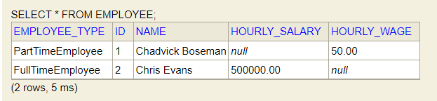

# JPA Inheritance Hierarchies and mapping

Create Entity abstract class ``Employee.java``, ``PartTimeEmployee.java`` extends ``Employee.java``

``Employee.java``

```java
@Entity
public abstract class Employee {
	@Id
	@GeneratedValue
	private Long id;
	@Column(nullable=false)
	private String name;
	
	protected Employee() {}
	
	public Employee(String name) {
		this.name=name;
	}
	
	public String getName() {
		return name;
	}


	public void setName(String name) {
		this.name = name;
	}


	@Override
	public String toString() {
		return "\nCourse [id=" + id + ", name=" + name + "]";
	}
	
	

}
```
``PartTimeEmployee.java``

```java
@Entity
public class PartTimeEmployee extends Employee {
	protected PartTimeEmployee() {

	}

	public PartTimeEmployee(String name, BigDecimal hourlyWage) {
		super(name);
		this.hourlyWage = hourlyWage;

	}

	private BigDecimal hourlyWage;
	}
```
``FullTimeEmployee.java``

```java
@Entity
public class FullTimeEmployee extends Employee {
	protected FullTimeEmployee() {
		
	}
	public FullTimeEmployee(String name, BigDecimal hourlySalary) {
		super(name);
		this.hourlySalary=hourlySalary;
	
		
	}
	
	private BigDecimal hourlySalary;
	}
```

``EmployeeRepository.java``

```java

@Repository
@Transactional
public class EmployeeRepository {
	
	private Logger logger = LoggerFactory.getLogger(this.getClass());
	@Autowired
	EntityManager em;
	
	/*Find by id*/
	public void insert(Employee employee) {
		em.persist(employee);
	}
	public List<Employee> findAllEmployees(){
		return em.createQuery("select e from Employee e",Employee.class).getResultList();
	}
	
	
}
```
Insert following to the ``JpaHibernateApplication.java``'s ``run(String ... args)`` method:

```java
		employeeRepository.insert(new PartTimeEmployee("Chadvick Boseman", new BigDecimal(50)));
		employeeRepository.insert(new FullTimeEmployee("Chris Evans", new BigDecimal(500000)));
		logger.info("All the Employees are -> {}",employeeRepository.findAllEmployees());
```
console-output:

```log
Hibernate: insert into employee (name, hourly_salary, dtype, id) values (?, ?, 'FullTimeEmployee', ?)
2021-09-29 16:34:47.216 TRACE 18752 --- [           main] o.h.type.descriptor.sql.BasicBinder      : binding parameter [1] as [VARCHAR] - [Chris Evans]
2021-09-29 16:34:47.217 TRACE 18752 --- [           main] o.h.type.descriptor.sql.BasicBinder      : binding parameter [2] as [NUMERIC] - [500000]
2021-09-29 16:34:47.217 TRACE 18752 --- [           main] o.h.type.descriptor.sql.BasicBinder      : binding parameter [3] as [BIGINT] - [2]
Hibernate: select employee0_.id as id2_1_, employee0_.name as name3_1_, employee0_.hourly_salary as hourly_s4_1_, employee0_.hourly_wage as hourly_w5_1_, employee0_.dtype as dtype1_1_ from employee employee0_
2021-09-29 16:34:47.261 TRACE 18752 --- [           main] o.h.type.descriptor.sql.BasicExtractor   : extracted value ([id2_1_] : [BIGINT]) - [1]
2021-09-29 16:34:47.263 TRACE 18752 --- [           main] o.h.type.descriptor.sql.BasicExtractor   : extracted value ([dtype1_1_] : [VARCHAR]) - [PartTimeEmployee]
2021-09-29 16:34:47.268 TRACE 18752 --- [           main] o.h.type.descriptor.sql.BasicExtractor   : extracted value ([name3_1_] : [VARCHAR]) - [Chadvick Boseman]
2021-09-29 16:34:47.270 TRACE 18752 --- [           main] o.h.type.descriptor.sql.BasicExtractor   : extracted value ([hourly_w5_1_] : [NUMERIC]) - [50.00]
2021-09-29 16:34:47.271 TRACE 18752 --- [           main] o.h.type.descriptor.sql.BasicExtractor   : extracted value ([id2_1_] : [BIGINT]) - [2]
2021-09-29 16:34:47.272 TRACE 18752 --- [           main] o.h.type.descriptor.sql.BasicExtractor   : extracted value ([dtype1_1_] : [VARCHAR]) - [FullTimeEmployee]
2021-09-29 16:34:47.272 TRACE 18752 --- [           main] o.h.type.descriptor.sql.BasicExtractor   : extracted value ([name3_1_] : [VARCHAR]) - [Chris Evans]
2021-09-29 16:34:47.273 TRACE 18752 --- [           main] o.h.type.descriptor.sql.BasicExtractor   : extracted value ([hourly_s4_1_] : [NUMERIC]) - [500000.00]
2021-09-29 16:34:47.288  INFO 18752 --- [           main] ication$$EnhancerBySpringCGLIB$$34ff0c8c : All the Employees are -> [
Course [id=1, name=Chadvick Boseman], 
Course [id=2, name=Chris Evans]]
```
h2-console: <br>


As we can see only one table is created , It improves performance as only one table is accessed

Also if you want to change the name of the Distinguishing column name from ``DTYPE`` to ``EmployeeType`` use annotation ``@DiscriminatorColumn(name = "EmployeeType")``.



____

InheritanceType
---

1 By default a single table is created in inheritance, but  if you want to explicitly specify, use annotation ``@Inheritance(strategy = InheritanceType.SINGLE_TABLE)`` (Its a default behavior so need to specify it)

2 But if you want different tables for each **concrete** Entity , you can use ``@Inheritance(strategy = InheritanceType.TABLE_PER_CLASS)`` annotation.


But the problem with above approach is common column are repeated in both the tables.

3 But if you want all Entities to have a separate table you can use ``@Inheritance(strategy = InheritanceType.JOINED)``


As we can see common columns are put into single parent table ``employee``.

4 Use ``@MappedSuperClass`` annotation, by this separate ``full_time_employee`` and ``part_time_employee`` table will be created. No ``Employee`` table will be created , ``Employee`` will act as a class whose properties are shared by ``PartTimeEmployee`` and ``FullTimeEmployee``

Note : if using ``@MappedSuperClass`` ,then ``@Entity`` can't be used. 

_To read more about @MappedSuperClass , just click on it :)_

Declarations:

``Employee.java``

```java
@MappedSuperclass
@DiscriminatorColumn(name = "EmployeeType")
public abstract class Employee {...}
```
Add following to your ``EmployeeRepository.java`` and delete or comment ``findAllEmployee()`` method.

```java
public List<PartTimeEmployee> findAllPartTimeEmployees(){
		return em.createQuery("select e from PartTimeEmployee e",PartTimeEmployee.class).getResultList();
	}
	public List<FullTimeEmployee> findAllFullTimeEmployees(){
		return em.createQuery("select e from FullTimeEmployee e",FullTimeEmployee.class).getResultList();
	}
```

Call above methods from ``JpaHibernateApplicaiton.java``'s ``run()`` method to see the changes.

____

JPQL Queries
----
``where``, ``join``, ``like`` queries with all different scenarios are written in 

[JPQLTest.java](https://github.com/prashantRmishra/JpaHibernateLearning/blob/jpa-hibernate-in-depth/src/test/java/com/prashant/jpa/hibernate/JpaHIbernate/repository/JpqlTest.java)

Criteria Query
----

[CriteriaQueryTest.java](https://github.com/prashantRmishra/JpaHibernateLearning/blob/jpa-hibernate-in-depth/src/test/java/com/prashant/jpa/hibernate/JpaHIbernate/repository/CriteriaQueryTest.java)


##Transaction Management

ACID Properties Should be maintained
For more details you can refer to **Section 12: Transaction Management** of your Udemy Course.

Difference between ``@Transactional`` of ``import javax.transaction.Transactional;`` and ``@Transactional`` of ``import org.springframework.transaction.annotation.Transactional;``

``import javax.transaction.Transactional; `` is used when you are working with one db only.

``org.springframework.transaction.annotation.Transactional; `` is used when you are working with more that one db or mq's (Message Queue e.g RabbitMq,JMS,etc.).

It is advisable to use springframework's ``@Transactional`` as it provides consistency over multiple db's and Mq's 

Isolation Levels(For Springframework's @Transactional)
---
1 Class level

We can implement it in following manner
``@Transactional(isolation = Isolation.DEFAULT)``
Similarly for ``.READ_COMMITTED``, ``.READ_UNCOMMITTED``,``.REPEATABLE_READ`` and ``.SERIALIZABLE``
FOr more info refer to **Section 12: Transaction Management** of your Udemy Course.

2 Global level

Add following Hibernate properties to your ``application.properties``

``spring.jpa.properties.hibernate.connection.isolation=2`` (2 : READ_COMMITED)

____

Spring Data JPA
----

**Up until now we saw Implementation of JPA as Hibernate**

Now we will see ``JpaRepository``

Create new java interface file ``CourseSpringDataJpaRepository.java``

```java
package com.prashant.jpa.hibernate.JpaHIbernate.repository;

import org.springframework.data.jpa.repository.JpaRepository;

import com.prashant.jpa.hibernate.JpaHIbernate.entity.Course;

public interface CourseSpringDataJpaRepository extends JpaRepository<Course, Long> {

}

```
``JpaRepository`` provides a lot of predefined methods for different db operations

Examples:

```java
@SpringBootTest(classes = JpaHibernateApplication.class)
class CourseSpringDataRepository {
	private Logger logger = LoggerFactory.getLogger(this.getClass());

	@Autowired
	CourseSpringDataJpaRepository repository;
	@Test
	void findById() {
		Optional<Course> course = repository.findById(10001L);
		assertTrue(course.isPresent());
	}
	
	@Test
	void playingAroundWithSpringDataJpaRepository() {
		/*
		 * Course course = repository.save(new Course("Ramayan in 1000 steps"));
		logger.info("Course added to db ->{} ",course);
		course.setName("Krishna lila in 100 steps");
		repository.save(course);*/
		
		logger.info("All courses -> {}",repository.findAll());
		logger.info("All count -> {}",repository.count());

	}
}
```

**How to add sorting to your queries**

```java
// FindAll() sorted courses in descending order
	@Test
	void sort() {
		Sort sort = Sort.by(Direction.DESC, "name");
		logger.info("All sorted course are -> {}", repository.findAll(sort));
		
	}
```
**Pagination Using Spring data JPA**

_Pagination is important, in front-end data optimization. Instead of sending all the data, only let say 5 rows are sent , and upon click of next, next 5 rows are sent. So this basically reduces overhead on the server_

```java
//Pagination using Spring data JPA
	@Test
	void pagination() {
		PageRequest page = PageRequest.of(0, 3); // (0,3)-> 0 index of 1st page of 3 pages 
		Page<Course> firstPage  = repository.findAll(page);
		logger.info("First page -> {}",firstPage.getContent()); // printing first page
		
		Pageable secondPageable  = firstPage.nextPageable();
		Page<Course> page2 = repository.findAll(secondPageable);
		logger.info("second page -> {}",page2.getContent()); // printing second page
		//Similary we can print 3rd page as well
	}
	
```


Custom Queries Using Spring Data JPA
---

Write following in ``CourseSpringDataJpaRepository.java``

```java
public interface CourseSpringDataJpaRepository extends JpaRepository<Course, Long> {
	public interface CourseSpringDataJpaRepository extends JpaRepository<Course, Long> {

	
	//Finding course with specific name eg 'JPA in 100 steps'
	List<Course> findByName(String name);
	
	
	//Finding by name and id
	List<Course> findByNameAndId(String name,Long id);
	
	//count by name
	Long countByName(String name);
	
	//order by name
	List<Course> findByNameOrderByIdDesc(String name);
	
	//courses where name is like "%someting%" ordered by id descending
	List<Course> findByNameLikeOrderByIdDesc(String name);
	
	//delete by name
	List<Course> deleteByName(String name);
	//--------------------------------------------------------
	//@ JPQL query
	@Query("Select c from Course c where c.name like '%100%'")
	List <Course> findByNameLikeJpqlQuery();
	
	//Native sql query
	@Query(value = "select * from course where name like '%100%'",nativeQuery = true)
	List <Course> findByNameLikeNative();
	
}
}

```

Test it using following methods in ``CourseSpringDataRepository.java`` 

```java
	@Test
	void findCourseByName() {
		List<Course> courses = repository.findByName("JPA in 100 steps");
		logger.info("Course -> {}",courses);
	}
	
	@Test
	void countByName() {
		Long course = repository.countByName("Angular in 10 steps");
		logger.info("Courses -> {}",course);
	}
	
	@Test
	void findByNameOrderByIdDesc() {
		List<Course> courses = repository.findByNameLikeOrderByIdDesc("Angular in 10 steps");
		logger.info("Courses ordered by Id in descending ->{}",courses);
	}
	
	@Test
	void findByNameLikeOrderByIdDesc() {
		List<Course> courses = repository.findByNameLikeOrderByIdDesc("%100%");
		logger.info("Courses like '%100%' ordered by Id in descending ->{}",courses);
	}
	
	@Test
	@DirtiesContext
	@Transactional
	void deleteByName() {
		List<Course> courses = repository.deleteByName("Angular in 10 steps");
		logger.info("deleted course are -> {}",courses);
	}
	
	@Test
	void findByNameLikeJpqlQuery() {
		List<Course> courses = repository.findByNameLikeJpqlQuery();
		logger.info("Courses -> {}",courses);
	}
	
	@Test
	void findByNameLikeNativeQuery() {
		List<Course> courses = repository.findByNameLikeNative();
		logger.info("Courses -> {}",courses);
	}
	
```


