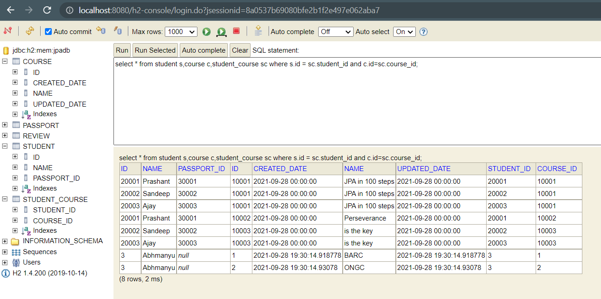
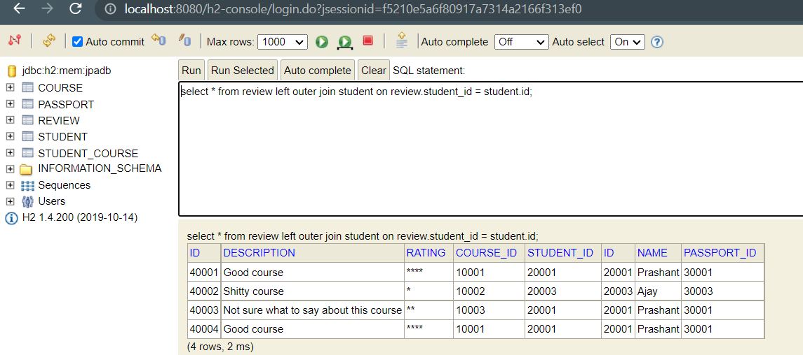

# JPA Hibernate in depth with Junit5 Test cases

**Let see methods of** ``EntityManager`` for performing various crud operations in ``CourseRepository.java`` <br>


```java
	@Repository
	@Transactional
	public class CourseRepository {
		
		@Autowired
		EntityManager em;
		
		/*Find by id*/
		public Course findById(Long id) {
			return em.find(Course.class, id);
		}
		
		/*Delete by id method*/
		public void delete(Long id) {
			
			em.remove(findById(id));
		}
		
		//For Insert or Update operations
		public Course save(Course c) {
			
			if(c.getId()==null) {
				em.persist(c);    //Insert 
			}
			else em.merge(c);    // Update
			return c;
		}
		
	}
```

### Importance of ``@Transactional`` annotation in Repository. <br>

```java
	@Repository
	@Transactional
	public class CourseRepository {
	....
		public void playWithEntityManager() {
			Course entity = new Course("WebServices");
			em.persist(entity);
			entity.setName("SpringBoot WeServices");
		}
	....
	}
```

Output <br>

```log
Hibernate: call next value for hibernate_sequence
Hibernate: insert into course (name, id) values (?, ?)
Hibernate: update course set name=? where id=?
```
As you can see after executing insert query for ``em.persist(entity)``, update is executed. 
This is beacause ``@Transactional`` ensures that there is atomic execution of operation that is either all or non.

***

## Some Imp Methods of ``EntityManager``


``flush()`` saves the changes till this point to database <br>

```java
	public void playWithEntityManager() {
		Course entity = new Course("WebServices");
		em.persist(entity);
		em.flush(); /*flush() is EntityManager method that upon calling changes are updated to db till that point
		             So, due to 2 flush() method this transaction will have two operations to perform.*/
		
		
		entity.setName("SpringBoot WeServices");
		em.flush();
		
	}
```

``detach(Object)`` If you want to stop tracking the changes of an object as a part of transaction <br>

```java
	public void playWithEntityManager() {
		Course entity = new Course("WebServices");
		em.persist(entity);
		em.flush(); /*flush() is EntityManager method that upon calling changes are updated to db till that point
		             So, due to 2 flush() method this transaction will have two operations to perform.*/
		
		
		entity.setName("SpringBoot WeServices");
		em.flush();
		
		Course course2 = new Course("Dragon ball z ");
		em.persist(course2);
		em.flush();
		
		em.detach(course2); // stop tracking changes to course2 as part of transaction
		course2.setName("One piece is the best anime ever");
		em.flush();
		
	}
```
Console Output

```log
Hibernate: call next value for hibernate_sequence
Hibernate: insert into course (name, id) values (?, ?)
Hibernate: update course set name=? where id=?
Hibernate: call next value for hibernate_sequence
Hibernate: insert into course (name, id) values (?, ?)
```
H2-console : As you can see ``One piece is the best anime ever`` is not updated <br>

 <br>

``clear()`` It is similar to ``detach(Object)`` , but once it is called it will everything that is being tracked by ``EntityManager`` .

```java

	public void playWithEntityManager() {
		Course entity = new Course("WebServices");
		em.persist(entity);
		em.flush(); /*flush() is EntityManager method that upon calling changes are updated to db till that point
		             So, due to 2 flush() method this transaction will have two operations to perform.*/
		
		Course course2 = new Course("Dragon ball z ");
		em.persist(course2);
		em.flush();
		
		em.clear(); // stops tracking changes to course2 and entity both
		course2.setName("One piece is the best anime ever");
		em.flush();
		
		entity.setName("SpringBoot WeServices");
		em.flush();
		
	}

```
Console Output <br>

```log
Hibernate: call next value for hibernate_sequence
Hibernate: insert into course (name, id) values (?, ?)
Hibernate: call next value for hibernate_sequence
Hibernate: insert into course (name, id) values (?, ?)
```
H2-console: As you can see after ``clear()`` changes to ``entity`` and ``course2`` are not updated.

 <br>

``refresh(Object)`` this method makes the object synchronize with the db , that is ``entity`` and ``course2`` will have the same value 
what is stored in the db before ``clear()`` or ``detach()`` is called. See the below code.

```java
	public void playWithEntityManager() {
		Course course1 = new Course("WebServices");
		em.persist(course1);
		Course course2 = new Course("Dragon ball z ");
		em.persist(course2);
		em.flush(); /*flush() is EntityManager method that upon calling changes are updated to db till that point
        So, due to 2 flush() method this transaction will have two operations to perform.*/
		
		course2.setName("One piece is the best anime ever");
		course1.setName("SpringBoot WeServices");
		
		em.refresh(course1); // refresh() updates the respective object to have the same values as the db, which is returned and hibernate select query is executed  
		em.flush();
		
		
	}
```
Console Output 

```log
Hibernate: insert into course (name, id) values (?, ?) //1st flush()
Hibernate: insert into course (name, id) values (?, ?) //2nd flush()
Hibernate: select course0_.id as id1_0_0_, course0_.name as name2_0_0_ from course course0_ where course0_.id=? //refresh() of course1
Hibernate: update course set name=? where id=? // update name of course 2
```
***

h2-console: As you can see ``course2``(id=2) is updated but ``course1``(id=1) is not updated

 <br>

***
### For Unit test cases you can see files in ``src/test/java`` folder <br>

``@DirtiesContext`` in Junit Test classes <br>

```java
	@Test
	@DirtiesContext // after Execution of this test the state will be reverted to prior state i.e deleted data will be
	//restored so that other dependent test cases are not affected.
	 
	void deleteCourse(){
		try {
			repository.delete(10002L);
			assertNull(repository.findById(10002L));
		} catch (Exception e) {
			assertFalse(true);
		}
	}
```
**JPQL Unit test cases** for findAll() courses from db. <br>

```java
@SpringBootTest(classes = JpaHibernateApplication.class)
class CourseRepositoryJpqlTest {
	private Logger logger = LoggerFactory.getLogger(this.getClass());

	@Autowired
	EntityManager manager;

	/*Generic Type*/
	@Test
	void JpqlFindAll_basic() {
		Query createQuery = manager.createQuery("select c from Course c");
		List resultList = createQuery.getResultList();
		logger.info("Result list is -> {}",resultList);
	}
	
	/*Typed query*/
	@Test
	void JpqlFindAll_Typed() {
		TypedQuery<Course> createQuery = manager.createQuery("select c from Course c",Course.class);
		List<Course> resultList = createQuery.getResultList();
		logger.info("Typed Result list is -> {}",resultList);
	}
	
	/* where clause*/
	@Test
	void JpqlFindAll_where() {
		TypedQuery<Course> createQuery = manager.createQuery("select c from Course c where name like '%100%' ",Course.class);
		List<Course> resultList = createQuery.getResultList();
		logger.info("Typed Result list with where clause is -> {}",resultList);
	}
	
	/*NamedQuery*/
	@Test
	void JpqlFindAll_NamedQuery() {
		TypedQuery<Course> createQuery = manager.createNamedQuery("find_all_courses",Course.class);
		List<Course> resultList = createQuery.getResultList();
		logger.info("Typed Result list with NamedQuery is -> {}",resultList);
	}
}

```

### Important Annotation provided by JPA and Hibernate

____

1.``@Table`` <br>
----
Defines name of the table <br>
Example ``@Table(name="CourseDetails")`` , so instead of ``course``, ``course_details`` table is created.

2.``@Column`` <br>
----
Defines the name of property in bean as column name in table
Example 

```java
@Coumn(name="fullname") // name will be 'fullname' in course table for property 'name'
private String name; 
/*To specify nullability of a column*/
@Column(name="fullname" nullable=false)
private String name;
```
3.``@UpdateTimestamp`` and ``@CreationTimestamp``
----
It is Hibernate custom annotation which is not specified by JPA
``@UpdateTimestamp`` For storing last updated date time of a row.
``@CreationTimestamp`` For storing created date time of a row.

```java
	@UpdateTimestamp
	private LocalDateTime updatedDate;
	@CreationTimestamp
	private LocalDateTime createdDate;
```

4.``@NamedQuery``
---
We have already seen How we can use ``@NamedQuery`` In ``Courses.java`` 

```java
@Entity
@NamedQuery(name = "find_all_courses", query = "select c from Course c")
public class Course {
....
}
```
5.``@NamedQueries``
---
For using multiple Named Query we can use it.
``@NamedQuery`` is specified inside ``@NamedQueries`` in value array

```java
	@NamedQueries(value = {
		@NamedQuery(name="find_all_courses",query = "select c from Course c"),
		@NamedQuery(name = "find_all_cources_with_where_clause",query = "select c from Course c where name like '%100%'")
		public class Course{
		...
		}
})
```
____

### Native Queries

**These are nothing but standard SQL Queries**

_List of test cases for native queries in: _ `` NativeQueriesTest.java``

1.Basic Query
---
```java
@Test
	void native_query_basic() {
		Query q  = manager.createNativeQuery("select * from course",Course.class);
		List resultList = q.getResultList();
		logger.info("select * from course : -> {}",resultList);
	}
```
2.Parameterized Query
---
```java
@Test
	void native_query_with_parameter() {
		Query q  = manager.createNativeQuery("select * from course where id =? ",Course.class);
		q.setParameter(1, 10001L);
		List resultList = q.getResultList();
		logger.info("select * from course where id = 10001L : -> {}",resultList);
	}
```
3.Named Parameterized query
---

```java
@Test
	void native_query_with_named_parameter() {
		Query q  = manager.createNativeQuery("select * from course where id =:id ",Course.class);
		q.setParameter("id", 10001L);
		List resultList = q.getResultList();
		logger.info("select * from course where id = 10001L : -> {}",resultList);
	}
```

4.Native Query for mass update
---

Sometimes It is not efficient to use JPQL e.g for updating all the rows of the table. <br>
If you were to do that with ``JPQL`` you will fetch each row and update them one by one which is not efficient.
Hence, you will have to use Native Query

```java
	@Test
	@Transactional // as update is being performed else it will throws TransactionRequiredException
	void native_query_mass_update() {
		Query q  = manager.createNativeQuery("update course set updated_date =sysdate()",Course.class);
		int noOfROwsUpdated = q.executeUpdate();
		logger.info("No of rows updated -> {}",noOfROwsUpdated);
	}
```
# Establishing Relationship between JPA and Hibernate  <br>

@OneToOne
---

**Afetr creating Entity of** ``Student.java``, ``Passport.java``,``Review.java``

As ``Student`` is to related to one ``Passport`` and ``Passport`` is related to one ``Student`` only. <br>
Create an foreign key of ``Passport`` (id) in ``Student`` or vice versa (as the relationship is oneToOne) <br>
In ``Student.java``

```java
	@Id
	@GeneratedValue
	private Long id;
	@Column(nullable=false)
	private String name;
	
	@OneToOne
	private Passport passport; // foreign key of Passport.id , Jpa will create column as passport_id in table student
	//The version of springboot while developing this app is 2.2.5 , and _id is auto appended in passport column of student table
```

**populate data in db like this from your** ``data.sql`` **file** <br>

```sql
--Passport
insert into Passport(id,number) values(30001,'E1234');
insert into Passport(id,number) values(30002,'E1235');
insert into passport(id,number) values(30003,'E1236');

--Student
insert into Student(id,name,passport_id) values(20001,'Prashant',30001);
insert into Student(id,name,passport_id) values(20002,'Sandeep',30002);
insert into Student(id,name,passport_id) values(20003,'Ajay',30003);
```
Console Output:

```log
Hibernate: create sequence hibernate_sequence start with 1 increment by 1
Hibernate: create table passport (id bigint not null, number varchar(255) not null, primary key (id))
Hibernate: create table student (id bigint not null, name varchar(255) not null, passport_id bigint, primary key (id))
Hibernate: alter table student add constraint FK6i2dofwfuu97njtfprqv68pib foreign key (passport_id) references passport
```

h2-console after running the app <br>


**Populating data in table** ``passport`` **and** ``student`` **using** ``EntityManager`` <br>

In ``StudentRepository.java`` add following method <br>

```java
	public void saveStudentWithPassport() {
		Passport passport = new Passport("TU3f1516029");
		em.persist(passport); // first insert passport in table else Exception will bee thrown for violating referential integrity constraint
		
		Student student   = new Student("Joe Biden");
		student.setPassport(passport);
		em.persist(student); // after persisting passport, we can easily persist student with any exception
		
	}
```
H2-console output <br>
 <br>

____
**Unit test cases for OneToOne relations i.e** ``student`` and ``passport`` <br>
``StudentRepository.java``

Eager Fetch 
----

```java
class StudentRepositoryTest {
	private Logger logger = LoggerFactory.getLogger(this.getClass());

	@Autowired
	StudentRepository repository;
	
	@Autowired
	EntityManager entityManager;

	@Test
	void findStudentWithPassport() {
		Student student = entityManager.find(Student.class, 20001L);
		logger.info("Student -> {}",student);
		logger.info("Passport -> {}",student.getPassport()); 
	}
	
}
```
Console Output: <br>

```log
Hibernate: select student0_.id as id1_3_0_, student0_.name as name2_3_0_, student0_.passport_id as passport3_3_0_, passport1_.id as id1_1_1_, passport1_.number as number2_1_1_ from student student0_ left outer join passport passport1_ on student0_.passport_id=passport1_.id where student0_.id=?
2021-09-26 18:15:40.020  INFO 19284 --- [           main] c.p.j.h.J.r.StudentRepositoryTest        : Student -> 
Student [name=Prashant]
2021-09-26 18:15:40.020  INFO 19284 --- [           main] c.p.j.h.J.r.StudentRepositoryTest        : Passport -> 
Passport [number=E1234]
```
**Eager Fetch :**  As you can see in the console output along with ``student`` detail ``passport`` details are also fetch with the help of ``left outer join``

Lazy Fetch
----
If I had written only ``logger.info("Student -> {}",student);`` in above test , still passport details would have been fetched, For large scaple application it would result in performance issues. To avoid this ``Lasy fetch`` is used. <br>

**For Lazy fetching specify**``type`` in ``@OneToOne`` annotation in ``Student.java``.

```java
	@Entity

public class Student {
	@Id
	@GeneratedValue
	private Long id;
	@Column(nullable=false)
	private String name;
	
	@OneToOne(fetch = FetchType.LAZY)
	private Passport passport;
	...
	}
```
**If you run the above test again you will get** ``org.hibernate.LazyInitializationException`` **This is because Hibernate session is killed right after fetching the** ``student`` **details.**

**But if you want to fetch passport details in lazy fetch , you will have to use** ``@Transactional`` to the test method , by using ``@Transactional`` Hibernate session is not killed and hibernate query is run to fetch passport details from the table ``passport`` <br>

```java
	@Test
	@Transactional
	void findStudentWithPassport() {
		Student student = entityManager.find(Student.class, 20001L);
		logger.info("Student -> {}",student);
		logger.info("Passport -> {}",student.getPassport());
	}
```

**See the below console output after running the same test in** ``lazy fetch`` , with ``@Transactional`` annotation. <br>

```log
Hibernate: select student0_.id as id1_3_0_, student0_.name as name2_3_0_, student0_.passport_id as passport3_3_0_ from student student0_ where student0_.id=?
2021-09-26 18:54:39.358  INFO 23096 --- [           main] c.p.j.h.J.r.StudentRepositoryTest        : Student -> 
Student [name=Prashant]
Hibernate: select passport0_.id as id1_1_0_, passport0_.number as number2_1_0_ from passport passport0_ where passport0_.id=?
2021-09-26 18:54:39.358  INFO 23096 --- [           main] c.p.j.h.J.r.StudentRepositoryTest        : Passport -> 
Passport [number=E1234]

```

<p style="color:green">This is the magic of hibernate , without exlicitly specifying it automatically fetched the passport details </p>

****

Transaction, Entity Manager and Persistence Contest
----
Once you define transaction (by specifying ``@Transactional``) you would also be creating something called **Persistence Context **, Persistence Contest is a place where all entities you are operating are stored.<br>


**The way we interact with**``Persistence Context`` **is by using** ``EntityManager``


```java
	@Test
	@Transactional // Persistence Context will be created
	void someTest() {
		
		//Operation 1 : Retrive Student
		Student student = entityManager.find(Student.class, 20002L);
		//Persistence Context will have (Student)
		
		//Operation 2 : Retrive Passport
		Passport passport = student.getPassport();
		//Persistence Context will have (Student,Passport)
		
		//Operation 3 : Update Passport number
		passport.setNumber("JB007");
		//Persistence Context will have (Student,Passport++)
		//Operation 4 : Update Student Name
		
		student.setName("Sandeep-updated");
		//Persistence Context will have (Student++,Passport++)
	}
	
```

Beacause of the ``@transactional`` the query will be fired at the end of all the operations.
If ``@Transactional`` is not specified then each operation will act as independent Transaction, and hibernate session will be killed after the operation 1 and we will get ``org.hibernate.LazyInitializationException``

****

OneToOne mapping Bidirectional Relationship
----
Till now the relationship between ``student`` and ``passport`` was **Unidirectional** ``oneToOne`` i.e we can fetch ``passport`` details while fetching ``student`` details. But if we want to fetch ``student`` details while fetching ``passport`` details the relationship has to be **Bidirectional** <br>

**We can achieve Bidirectional OneToOne Relationship by adding**``Student`` property to ``Passport.java``

```java

@Entity
public class Passport {
	@Id
	@GeneratedValue
	private Long id;
	@Column(nullable = false)
	private String number;
	
	@OneToOne(fetch = FetchType.LAZY)
	private Student student;
	....
	}
```

<p style="color:red"> But this will lead in redundancy i.e Student will be referencing to passport and passport will also be referencing to student, this will lead in duplicate data.</p> <br>


<p style="color:green"> To avoid this we can make one of the entity as owning Entity. Let say I want to make Student Owning Entity, then We will have to add <strong style="color:black"> mappedBy="passport" as "passport" is the variable name defined in Student.java </strong> attribute to non owning side of the relationship i.e passport </p> 


```java
@OneToOne(fetch = FetchType.LAZY,mappedBy = "passport")
	private Student student;
```

H2-console output: <br>


Now we can easily retrieve ``student`` details by retrieving ``passport`` details <br>

```java
@Test
	@Transactional
	void findPassportWithAssociatedStudent() {
		Passport passport = entityManager.find(Passport.class, 30002L);
		logger.info("Passport -> {}",passport);
		logger.info("Student -> {}",passport.getStudent());
	}
```

```log
2021-09-27 07:14:19.078  INFO 20896 --- [           main] c.p.j.h.J.r.StudentRepositoryTest        : Passport -> 
Passport [number=E1235]
2021-09-27 07:14:19.079  INFO 20896 --- [           main] c.p.j.h.J.r.StudentRepositoryTest        : Student -> 
Student [name=Sandeep]
```

@OneToMany 
----

**OneToMany** : one ``course`` can have many ``review``'s i.e ``course`` can participate more that once in the relationship, but ``review`` can participate only once. 
So , ``review`` is associated with ``course``, and without ``course`` , ``review`` does not make any sense. <br>

Modify ``Review.java`` like following code : <br>

```java
@Entity
public class Review {
	@Id
	@GeneratedValue
	private Long id;
	private String rating;
	
	private String description;
	
	@ManyToOne  /// as many review Obj could be associated to only one course
	private Course course; 
	....
	}
```

**NOTE:** In course_review(oneToMany) relationship primary_key will be review(id) as it will be unique. You know this.

Example, No one ``review`` id can belong to two different ``course``.


Modify ``Course.java`` like following code : <br>

```java
@Entity
@NamedQuery(name = "find_all_courses", query = "select c from Course c")
public class Course {
	@Id
	@GeneratedValue
	private Long id;
	private String name;
	
	@UpdateTimestamp
	private LocalDateTime updatedDate;
	@CreationTimestamp
	private LocalDateTime createdDate;
	
	@OneToMany(mappedBy = "course")  /// As this Course obj could have many review
	List<Review> reviews = new ArrayList<>();
	
	public List<Review> getReviews() {
		return reviews;
	}
	/*Instead of setReview(List<Review> reviews) , we should have addReview(Review r)
	that lets user add a review. */
	public void addReviews(Review review) {  
		this.reviews.add(review);
	}
	/*Similarly, removeReview(Review r) will let user to remove a review*/
	public void removeReview(Review review) {
		this.reviews.remove(review);
	}
	
```
**As** ``review`` **is the owning side of the relationship. Hence,**``mappedBy`` **will be put in non-owning side**``course`` <br>

**Adding new reviews to course**

```java

public void addReviewForCOurse() {
	
		//1.find course whose review is to be given
		Course course = findById(10002L);
		
		//Review given to that course
		logger.info("List of Reviews -> {}",course.getReviews());
		
		//2.create two more reviews
		Review review1 = new Review("****", "Its a very good course");
		Review review2 = new Review("***","Its all course");
		
		//3.Setting the Relationship
		//assign review1 to course that has id 10002
		course.addReviews(review1);
		/* We have to assign review to course as well 
		 * because of bidirectional relationship oneToMany (course->review)
		 * manyToOne (review->course)
		 * Owning side is review
		 * */
		
		//assign course a review 
		review1.setCourse(course);
		
		//repeating the same what we did above
		course.addReviews(review2);
		review2.setCourse(course);
		
		//persist review 
		/*We don't need to persist course as we are not changing anything in it
		 * we just need to persist the review1, review2 */
		em.persist(review1);
		em.persist(review2);
		
		
	}
	
```
Finally call ``addReviewForCOurse();`` from main file to see the changes in Review table <br>

You can generalize the method ``addReviewForCOurse()`` by overloading it with parameters as ``addReviewForCOurse(Long courseId, List<Review> reviews)``, you can see its implementation in ``CourseRepository.java``. <br>
____

**Remember by default on @OneToMany side (course) fetching is** _ LAZY _ **and on @ManyToOne side(review) fetching is** _ EAGER_ .<br>

As you can see:

``@OneToMany`` (``course``): <br>

```java
	@Test
	@Transactional
	void retrieveReviewsForCourse() {
		Course c  = repository.findById(10003L);
		logger.info("Reviews for the course id 10003",c.getReviews());
		
	}
```
Console Output : 
<br> As we can see ``c.getReview()`` from test is not fetched directly i.e select query is run then ``c.getReview()`` returned review , Hence ``@OneToMany`` by default uses _ LAZY_ fetching <br>

```log
Hibernate: select course0_.id as id1_0_0_, course0_.created_date as created_2_0_0_, course0_.name as name3_0_0_, course0_.updated_date as updated_4_0_0_ from course course0_ where course0_.id=?
2021-09-28 08:36:28.031 TRACE 19212 --- [           main] o.h.type.descriptor.sql.BasicBinder      : binding parameter [1] as [BIGINT] - [10003]
2021-09-28 08:36:28.047 TRACE 19212 --- [           main] o.h.type.descriptor.sql.BasicExtractor   : extracted value ([created_2_0_0_] : [TIMESTAMP]) - [2021-09-28T00:00]
2021-09-28 08:36:28.048 TRACE 19212 --- [           main] o.h.type.descriptor.sql.BasicExtractor   : extracted value ([name3_0_0_] : [VARCHAR]) - [is the key]
2021-09-28 08:36:28.049 TRACE 19212 --- [           main] o.h.type.descriptor.sql.BasicExtractor   : extracted value ([updated_4_0_0_] : [TIMESTAMP]) - [2021-09-28T00:00]
2021-09-28 08:36:28.080 TRACE 19212 --- [           main] org.hibernate.type.CollectionType        : Created collection wrapper: [com.prashant.jpa.hibernate.JpaHIbernate.entity.Course.reviews#10003]
Hibernate: select reviews0_.course_id as course_i4_2_0_, reviews0_.id as id1_2_0_, reviews0_.id as id1_2_1_, reviews0_.course_id as course_i4_2_1_, reviews0_.description as descript2_2_1_, reviews0_.rating as rating3_2_1_ from review reviews0_ where reviews0_.course_id=?
2021-09-28 08:36:28.089  INFO 19212 --- [           main] c.p.j.h.J.r.CourseRepositoryTest         : Reviews for the course id 10003 -> [Review[**,Not sure what to say about this course]]
```
``@ManyToOne`` (``Review``): <br>

```java
	@Test
	@Transactional
	void retieveCourceForReview() {
		//1.fetching review
		Review r = em.find(Review.class, 40004L);
		//2.eager fetching of courses
		logger.info("The courses for the given review are ->{} ",r.getCourse());
	}
```
Console Output: 
<br>
As we can see the Courses are fetched without running select query , this is because courses were EAGER fetched by review <br>

```log
Hibernate: select review0_.id as id1_2_0_, review0_.course_id as course_i4_2_0_, review0_.description as descript2_2_0_, review0_.rating as rating3_2_0_, course1_.id as id1_0_1_, course1_.created_date as created_2_0_1_, course1_.name as name3_0_1_, course1_.updated_date as updated_4_0_1_ from review review0_ left outer join course course1_ on review0_.course_id=course1_.id where review0_.id=?
2021-09-28 08:40:03.703 TRACE 22496 --- [           main] o.h.type.descriptor.sql.BasicBinder      : binding parameter [1] as [BIGINT] - [40004]
2021-09-28 08:40:03.712 TRACE 22496 --- [           main] o.h.type.descriptor.sql.BasicExtractor   : extracted value ([id1_0_1_] : [BIGINT]) - [10001]
2021-09-28 08:40:03.720 TRACE 22496 --- [           main] o.h.type.descriptor.sql.BasicExtractor   : extracted value ([course_i4_2_0_] : [BIGINT]) - [10001]
2021-09-28 08:40:03.722 TRACE 22496 --- [           main] o.h.type.descriptor.sql.BasicExtractor   : extracted value ([descript2_2_0_] : [VARCHAR]) - [Good course]
2021-09-28 08:40:03.722 TRACE 22496 --- [           main] o.h.type.descriptor.sql.BasicExtractor   : extracted value ([rating3_2_0_] : [VARCHAR]) - [****]
2021-09-28 08:40:03.727 TRACE 22496 --- [           main] o.h.type.descriptor.sql.BasicExtractor   : extracted value ([created_2_0_1_] : [TIMESTAMP]) - [2021-09-28T00:00]
2021-09-28 08:40:03.727 TRACE 22496 --- [           main] o.h.type.descriptor.sql.BasicExtractor   : extracted value ([name3_0_1_] : [VARCHAR]) - [JPA in 100 steps]
2021-09-28 08:40:03.728 TRACE 22496 --- [           main] o.h.type.descriptor.sql.BasicExtractor   : extracted value ([updated_4_0_1_] : [TIMESTAMP]) - [2021-09-28T00:00]
2021-09-28 08:40:03.747 TRACE 22496 --- [           main] org.hibernate.type.CollectionType        : Created collection wrapper: [com.prashant.jpa.hibernate.JpaHIbernate.entity.Course.reviews#10001]
2021-09-28 08:40:03.750  INFO 22496 --- [           main] c.p.j.h.J.r.CourseRepositoryTest         : The courses for the given review are ->
Course [id=10001, name=JPA in 100 steps] 
```

Note : Any relation ending with __ToOne (ManyToOne,OneToOne) is always EAGER FETCHING and RElation ending with __ToMany (ManyToMany,OneToMany) is always LAZY FETCHING.
----
____


@ManyToMany
----

**ManyToMany**: Many ``student`` can enroll in Many ``course``. Similarly many ``course`` can have many ``student`` <br>
Here none of the table will be owning, hence join table comes into picture ``course_students(course_id,students_id)`` and  ``student_courses(student_id,courses_id)``

Add following to ``Student.java``

```java
	@ManyToMany
	private List<Course> courses  = new ArrayList<>();
	public List<Course> getCourses() {
		return courses;
	}
	public void addCourse(Course c) {
		 courses.add(c);
	}
```
Add following to ``Course.java``

```java
	@ManyToMany
	private List<Student> students  = new ArrayList<>();
```
Console output after running the code :
<br>
As we can see two tables are created ``course_students`` and ``student_courses`` because we have specifies ``@ManyToMany`` in both the classes.

```log
Hibernate: create table course_students (course_id bigint not null, students_id bigint not null)
Hibernate: create table student_courses (student_id bigint not null, courses_id bigint not null)
Hibernate: alter table course_students add constraint FK532dg5ikp3dvbrbiiqefdoe6m foreign key (students_id) references student
Hibernate: alter table course_students add constraint FKgut5xj4l8sk6hg3l0t2su2pnc foreign key (course_id) references course
Hibernate: alter table student_courses add constraint FKlwviiijdg10oc2ui4yl7adh1o foreign key (courses_id) references course
Hibernate: alter table student_courses add constraint FKiqufqwgb6im4n8xslhjvxmt0n foreign key (student_id) references student

```
**Fixing two join table problem**
We can make one of the Entity as the owning side of the relation i.e either student or course it doesn't matter.

Modify ``Course.java`` as 

```java
@ManyToMany(mappedBy = "courses")
	private List<Student> students  = new ArrayList<>();
```
Now ``Student.java`` is the owning side.

Console Output: 

```log
Hibernate: create table student_courses (students_id bigint not null, courses_id bigint not null)
Hibernate: alter table student_courses add constraint FKlwviiijdg10oc2ui4yl7adh1o foreign key (courses_id) references course
Hibernate: alter table student_courses add constraint FKrgo64lg01pxfwq2x9753jgywc foreign key (students_id) references student
```

Renaming the names of Join Table and its column from ``student_courses(students_id,courses_id)`` to ``student_course(student_id,course_id)``

On the owning side the relation (``Student.java``) we can add ``@JoinTable`` and ``@JoinColumns`` , ``@InverseJoinColumns``

```java
	@ManyToMany
	@JoinTable(name = "student_course",
	joinColumns = @JoinColumn(name="student_id"), //joinColumn: column name of this table
	inverseJoinColumns = @JoinColumn(name="course_id")  //inverseJoinColumn: column name of other table (non owning)
	)
	private List<Course> courses  = new ArrayList<>();
```
Console Output :

 ```log
Hibernate: create table student_course (student_id bigint not null, course_id bigint not null)
Hibernate: alter table student_course add constraint FKejrkh4gv8iqgmspsanaji90ws foreign key (course_id) references course
Hibernate: alter table student_course add constraint FKq7yw2wg9wlt2cnj480hcdn6dq foreign key (student_id) references student
 ```
**Retrieving data using JPA relationship**

We know @ManyToMany do lazy fetching hence, below code will lead to Exception

```java
	@Test
	void retrieveStudentAndCourse() {
		Student student = repository.findById(20001L);
		logger.info("Student with id 20001 -> {}",student);
		logger.info("Course student 20001 enrolled in -> {}",student.getCourses());
		
	}
```
Console Output:

```log
Reported exception:
org.hibernate.LazyInitializationException: failed to lazily initialize a collection of role: com.prashant.jpa.hibernate.JpaHIbernate.entity.Student.courses, could not initialize proxy - no Session
```
Hence, Add ``@Transactional`` to ensure Hibernate session is not killed.

```java
	@Test
	@Transactional
	void retrieveStudentAndCourse() {
		Student student = repository.findById(20001L);
		logger.info("Student with id 20001 -> {}",student);
		logger.info("Course student 20001 enrolled in -> {}",student.getCourses());
		
	}
```
```log
Hibernate: select student0_.id as id1_3_0_, student0_.name as name2_3_0_, student0_.passport_id as passport3_3_0_ from student student0_ where student0_.id=?
2021-09-28 18:58:11.070 TRACE 4228 --- [           main] o.h.type.descriptor.sql.BasicBinder      : binding parameter [1] as [BIGINT] - [20001]
2021-09-28 18:58:11.084 TRACE 4228 --- [           main] o.h.type.descriptor.sql.BasicExtractor   : extracted value ([name2_3_0_] : [VARCHAR]) - [Prashant]
2021-09-28 18:58:11.085 TRACE 4228 --- [           main] o.h.type.descriptor.sql.BasicExtractor   : extracted value ([passport3_3_0_] : [BIGINT]) - [30001]
2021-09-28 18:58:11.098 TRACE 4228 --- [           main] org.hibernate.type.CollectionType        : Created collection wrapper: [com.prashant.jpa.hibernate.JpaHIbernate.entity.Student.courses#20001]
2021-09-28 18:58:11.109  INFO 4228 --- [           main] c.p.j.h.J.r.StudentRepositoryTest        : Student with id 20001 -> 
Student [name=Prashant]
Hibernate: select courses0_.student_id as student_1_4_0_, courses0_.course_id as course_i2_4_0_, course1_.id as id1_0_1_, course1_.created_date as created_2_0_1_, course1_.name as name3_0_1_, course1_.updated_date as updated_4_0_1_ from student_course courses0_ inner join course course1_ on courses0_.course_id=course1_.id where courses0_.student_id=?
2021-09-28 18:58:11.109  INFO 4228 --- [           main] c.p.j.h.J.r.StudentRepositoryTest        : Course student 20001 enrolled in -> [
Course [id=10001, name=JPA in 100 steps], 
Course [id=10002, name=Perseverance]]
```

Adding new Student and Course having ``@ManyToMany`` relationship with each other.

``StudentRepository.java``

```java
public void insertStudentAndCourse() {
		Student student = new Student("Abhmanyu");
		Course course1 = new Course("ONGC");
		Course course2 = new Course("BARC");
		em.persist(course2);
		em.persist(course1);
		em.persist(student);
		course2.addStudent(student);
		course1.addStudent(student);
		student.addCourse(course2);
		student.addCourse(course1);
		
		
	}
```
Console-Output:

```log
Hibernate: insert into course (created_date, name, updated_date, id) values (?, ?, ?, ?)
2021-09-28 19:30:14.924 TRACE 2296 --- [           main] o.h.type.descriptor.sql.BasicBinder      : binding parameter [1] as [TIMESTAMP] - [2021-09-28T19:30:14.918777600]
2021-09-28 19:30:14.925 TRACE 2296 --- [           main] o.h.type.descriptor.sql.BasicBinder      : binding parameter [2] as [VARCHAR] - [BARC]
2021-09-28 19:30:14.926 TRACE 2296 --- [           main] o.h.type.descriptor.sql.BasicBinder      : binding parameter [3] as [TIMESTAMP] - [2021-09-28T19:30:14.918777600]
2021-09-28 19:30:14.927 TRACE 2296 --- [           main] o.h.type.descriptor.sql.BasicBinder      : binding parameter [4] as [BIGINT] - [1]
Hibernate: insert into course (created_date, name, updated_date, id) values (?, ?, ?, ?)
2021-09-28 19:30:14.931 TRACE 2296 --- [           main] o.h.type.descriptor.sql.BasicBinder      : binding parameter [1] as [TIMESTAMP] - [2021-09-28T19:30:14.930779700]
2021-09-28 19:30:14.931 TRACE 2296 --- [           main] o.h.type.descriptor.sql.BasicBinder      : binding parameter [2] as [VARCHAR] - [ONGC]
2021-09-28 19:30:14.931 TRACE 2296 --- [           main] o.h.type.descriptor.sql.BasicBinder      : binding parameter [3] as [TIMESTAMP] - [2021-09-28T19:30:14.930779700]
2021-09-28 19:30:14.932 TRACE 2296 --- [           main] o.h.type.descriptor.sql.BasicBinder      : binding parameter [4] as [BIGINT] - [2]
Hibernate: insert into student (name, passport_id, id) values (?, ?, ?)
2021-09-28 19:30:14.932 TRACE 2296 --- [           main] o.h.type.descriptor.sql.BasicBinder      : binding parameter [1] as [VARCHAR] - [Abhmanyu]
2021-09-28 19:30:14.933 TRACE 2296 --- [           main] o.h.type.descriptor.sql.BasicBinder      : binding parameter [2] as [BIGINT] - [null]
2021-09-28 19:30:14.933 TRACE 2296 --- [           main] o.h.type.descriptor.sql.BasicBinder      : binding parameter [3] as [BIGINT] - [3]
Hibernate: insert into student_course (student_id, course_id) values (?, ?)
2021-09-28 19:30:14.941 TRACE 2296 --- [           main] o.h.type.descriptor.sql.BasicBinder      : binding parameter [1] as [BIGINT] - [3]
2021-09-28 19:30:14.942 TRACE 2296 --- [           main] o.h.type.descriptor.sql.BasicBinder      : binding parameter [2] as [BIGINT] - [1]
Hibernate: insert into student_course (student_id, course_id) values (?, ?)
2021-09-28 19:30:14.943 TRACE 2296 --- [           main] o.h.type.descriptor.sql.BasicBinder      : binding parameter [1] as [BIGINT] - [3]
2021-09-28 19:30:14.943 TRACE 2296 --- [           main] o.h.type.descriptor.sql.BasicBinder      : binding parameter [2] as [BIGINT] - [2]

```

h2-Console :



Practice Example :
One Student can give many review so ``student`` and ``review`` are in ``@OneToMany`` relationship with each other.

So, ``review`` will owning side.

``Review.java``

```java

	@ManyToOne  /// As Many can be given by one student
	private Student student;
	
	public Student getStudent() {
		return student;
	}
	public void setStudent(Student student) {
		this.student = student;
	}

``Student.java``

```java
@OneToMany (mappedBy = "student") // as this student can give many reviews
	private List<Review> reviews= new ArrayList<>();
	
	private void addReview(Review review) {
		this.reviews.add(review);
	}
	private List<Review> getReviews(){
		return this.reviews;
	}
```

``data.sql``

```sql
--Review
insert into Review(id,rating,description,course_id,student_id) values(40001,'****','Good course',10001,20001);
insert into Review(id,rating,description,course_id,student_id) values(40004,'****','Good course',10001,20001);
insert into Review(id,rating,description,course_id,student_id) values(40002,'*','Shitty course',10002,20003);
insert into Review(id,rating,description,course_id,student_id) values(40003,'**','Not sure what to say about this course',10003,20001);
```
H2-console:


