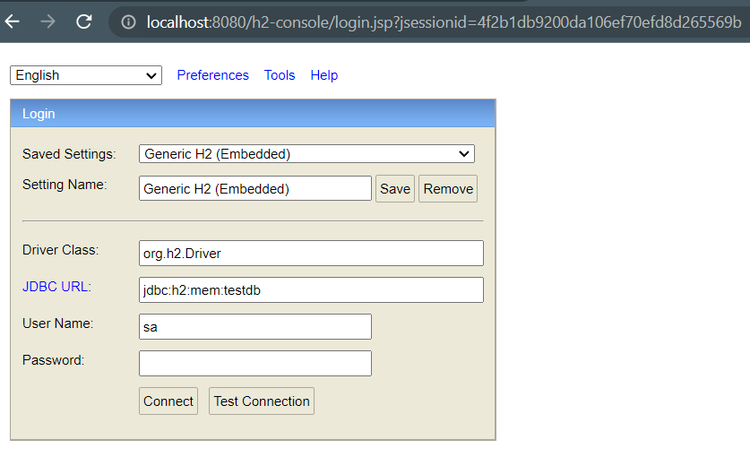

# Journey from Spring JDBC to JPA
## In this project I have added steps to migrate form Spring JDBC to JPA 
### We will be using H2 DB for in memory db, JPA for hibernate , starter-web for web application.
**Add following dependencies to your pom.xml file**

```xml
		<dependency>
			<groupId>org.springframework.boot</groupId>
			<artifactId>spring-boot-starter-data-jpa</artifactId>
		</dependency>
		<dependency>
			<groupId>org.springframework.boot</groupId>
			<artifactId>spring-boot-starter-jdbc</artifactId>
		</dependency>
		<dependency>
			<groupId>org.springframework.boot</groupId>
			<artifactId>spring-boot-starter-web</artifactId>
		</dependency>

		<dependency>
			<groupId>com.h2database</groupId>
			<artifactId>h2</artifactId>
			<scope>runtime</scope>
		</dependency>
```

**Create in memory db by adding following to your ** ``application.properties`` <br>

```properties
spring.datasource.url=jdbc:h2:mem:testdb

```
**To access H2 console on /h2-console endpoint in the browser add following to your** ``application.properties`` <br>

```properties
spring.h2.console.enabled=true

```



_In memory db created using h2 will be available as long as application is running i.e It will be destroyed once the application is killed_
_Hence we can use the autoconfiguration feature of spring boot to detect the table scripts to create the tables that we need every time the application is up_
<br>

My ``data.sql`` has following scripts in it. <br>

```sql
create table person(
	id integer not null,
	name varchar(255) not null, 
	location varchar(255),
	birth_date timestamp,
	primary key(id)
);
insert into person(id,name,location,birth_date)
values(1,'prashant','mumbai',sysdate());

insert into person(id,name,location,birth_date)
values(2,'Jatin','Las vegas',sysdate());  

```
***
## Need of JPA(Java Persistent API) <br>

1. JPA tells instead of mapping queries to the table, map the object directly to the table.
2. Avoids writing complex sql queries. ie job of writing queries shifts from developers to framework.
3. **JPA** is like interface that gives specifications and **HIBERNATE** is like implementation of **JPA**.
4. **Hibernate** was present long before **JPA**, so seeing the success of **Hibernate** as ORM(Object relation mapping ) its specification **JPA** was created.
5. Hibernate has lot more feature than JPA

***
**Connect JPA to db**
1. You need ``EntityManager`` interface <br>
 1. add following to your ``@Repository`` annotated class
 
 ```java
 
@Repository
@Transactional // for DB transaction management
public class PersonJpaRepository {
	//Connect to database
	@PersistenceContext // stores the details of all db operations of the current or running session
	EntityManager entityManager; // interface to the PersistenceContext
	public Person findById(int id){
		return entityManager.find(Person.class, id); // find(class,primary_key);
	
	}
	....
 ```
 _To see the query running in the background when JPA runs add following to_ ``application.properties `` to _see query running in the console._ <br>
 
 ```properties
 spring.jpa.show-sql=true
 ```
 
***
Script-based DataSource initialization is performed, by default, before any JPA  ``EntityManagerFactory``  beans are created. ``schema.sql`` can be used to create the schema for JPA-managed entities and ``data.sql`` can be used to populate it. While we do not recommend using multiple data source initialization technologies, if you want script-based DataSource initialization to be able to build upon the schema creation performed by Hibernate, set ``spring.jpa.defer-datasource-initialization`` to ``true`` in your ``application.properties``. This will defer data source initialization until after any ``EntityManagerFactory`` beans have been created and initialized. schema.sql can then be used to make additions to any schema creation performed by Hibernate and ``data.sql`` can be used to populate it. <br>

***
 
**JPQL (Java Persistence Query Language)** <br>

1. JPQL is bit different from standard SQL, Here your query maps your entity to the table. <br>
2. For example : for getting all the Person from the table person standard sql would be ``select * from person`` in ``JdbcApplication.java`` that you can see in ``findAll()`` method . <br>
3. For ``JpaApplication.java`` it is bit different <br>

 	 create JPQL on the entity class ``Person.java`` as <br>
 
 ```java
 
		@Entity
		@NamedQuery(name = "find_all_persons",query = "select p from Person p") //JPQL
		@Table(name  ="person") // no need as the table name match
		public class Person {
		....
		}
 ```
 	 Prepare NamedQuery in ``EntityManger`` <br>
 	
 ```java
 public List<Person> findAll(){
		TypedQuery<Person> typedQuery =  entityManager.createNamedQuery("find_all_persons",Person.class); //(find_all_persons:query name,Persons.class: type of entity it will return)
		return typedQuery.getResultList();
	}
 ```
	
		
		
	

 	
 


##Important NOTE for Running JDBC and JPA at a time <br>

1.I have added both JDBC and JPA code in separate files.comment `` @SpringBootApplication `` of one to run other. <br>

2.If you are running ``JpaApplication.java`` make sure to comment all scripts from ``data.sql`` file as you already have ``@Entity`` annotation with the ``Person.java`` class file. <br>

3.Similarly if you are running ``JdbcApplication.java`` make sure to comment ``@SpringBootApplication`` annotation of ``JdbcApplication.java``  ``@Entity`` , ``@Table`` , ``@Id`` , ``@GeneratedValue`` annotations. <br> 

***

