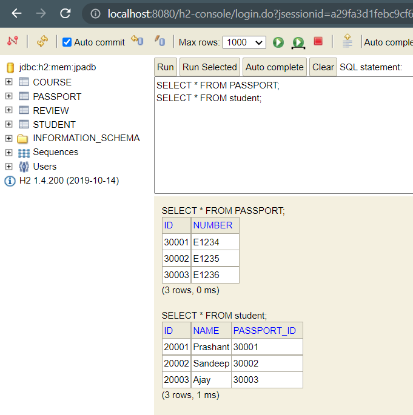

# JPA Hibernate in depth with Junit5 Test cases

**Let see methods of** ``EntityManager`` for performing various crud operations in ``CourseRepository.java`` <br>


```java
	@Repository
	@Transactional
	public class CourseRepository {
		
		@Autowired
		EntityManager em;
		
		/*Find by id*/
		public Course findById(Long id) {
			return em.find(Course.class, id);
		}
		
		/*Delete by id method*/
		public void delete(Long id) {
			
			em.remove(findById(id));
		}
		
		//For Insert or Update operations
		public Course save(Course c) {
			
			if(c.getId()==null) {
				em.persist(c);    //Insert 
			}
			else em.merge(c);    // Update
			return c;
		}
		
	}
```

### Importance of ``@Transactional`` annotation in Repository. <br>

```java
	@Repository
	@Transactional
	public class CourseRepository {
	....
		public void playWithEntityManager() {
			Course entity = new Course("WebServices");
			em.persist(entity);
			entity.setName("SpringBoot WeServices");
		}
	....
	}
```

Output <br>

```log
Hibernate: call next value for hibernate_sequence
Hibernate: insert into course (name, id) values (?, ?)
Hibernate: update course set name=? where id=?
```
As you can see after executing insert query for ``em.persist(entity)``, update is executed. 
This is beacause ``@Transactional`` ensures that there is atomic execution of operation that is either all or non.

***

## Some Imp Methods of ``EntityManager``


``flush()`` saves the changes till this point to database <br>

```java
	public void playWithEntityManager() {
		Course entity = new Course("WebServices");
		em.persist(entity);
		em.flush(); /*flush() is EntityManager method that upon calling changes are updated to db till that point
		             So, due to 2 flush() method this transaction will have two operations to perform.*/
		
		
		entity.setName("SpringBoot WeServices");
		em.flush();
		
	}
```

``detach(Object)`` If you want to stop tracking the changes of an object as a part of transaction <br>

```java
	public void playWithEntityManager() {
		Course entity = new Course("WebServices");
		em.persist(entity);
		em.flush(); /*flush() is EntityManager method that upon calling changes are updated to db till that point
		             So, due to 2 flush() method this transaction will have two operations to perform.*/
		
		
		entity.setName("SpringBoot WeServices");
		em.flush();
		
		Course course2 = new Course("Dragon ball z ");
		em.persist(course2);
		em.flush();
		
		em.detach(course2); // stop tracking changes to course2 as part of transaction
		course2.setName("One piece is the best anime ever");
		em.flush();
		
	}
```
Console Output

```log
Hibernate: call next value for hibernate_sequence
Hibernate: insert into course (name, id) values (?, ?)
Hibernate: update course set name=? where id=?
Hibernate: call next value for hibernate_sequence
Hibernate: insert into course (name, id) values (?, ?)
```
H2-console : As you can see ``One piece is the best anime ever`` is not updated <br>

 <br>

``clear()`` It is similar to ``detach(Object)`` , but once it is called it will everything that is being tracked by ``EntityManager`` .

```java

	public void playWithEntityManager() {
		Course entity = new Course("WebServices");
		em.persist(entity);
		em.flush(); /*flush() is EntityManager method that upon calling changes are updated to db till that point
		             So, due to 2 flush() method this transaction will have two operations to perform.*/
		
		Course course2 = new Course("Dragon ball z ");
		em.persist(course2);
		em.flush();
		
		em.clear(); // stops tracking changes to course2 and entity both
		course2.setName("One piece is the best anime ever");
		em.flush();
		
		entity.setName("SpringBoot WeServices");
		em.flush();
		
	}

```
Console Output <br>

```log
Hibernate: call next value for hibernate_sequence
Hibernate: insert into course (name, id) values (?, ?)
Hibernate: call next value for hibernate_sequence
Hibernate: insert into course (name, id) values (?, ?)
```
H2-console: As you can see after ``clear()`` changes to ``entity`` and ``course2`` are not updated.

 <br>

``refresh(Object)`` this method makes the object synchronize with the db , that is ``entity`` and ``course2`` will have the same value 
what is stored in the db before ``clear()`` or ``detach()`` is called. See the below code.

```java
	public void playWithEntityManager() {
		Course course1 = new Course("WebServices");
		em.persist(course1);
		Course course2 = new Course("Dragon ball z ");
		em.persist(course2);
		em.flush(); /*flush() is EntityManager method that upon calling changes are updated to db till that point
        So, due to 2 flush() method this transaction will have two operations to perform.*/
		
		course2.setName("One piece is the best anime ever");
		course1.setName("SpringBoot WeServices");
		
		em.refresh(course1); // refresh() updates the respective object to have the same values as the db, which is returned and hibernate select query is executed  
		em.flush();
		
		
	}
```
Console Output 

```log
Hibernate: insert into course (name, id) values (?, ?) //1st flush()
Hibernate: insert into course (name, id) values (?, ?) //2nd flush()
Hibernate: select course0_.id as id1_0_0_, course0_.name as name2_0_0_ from course course0_ where course0_.id=? //refresh() of course1
Hibernate: update course set name=? where id=? // update name of course 2
```
***

h2-console: As you can see ``course2``(id=2) is updated but ``course1``(id=1) is not updated

 <br>

***
### For Unit test cases you can see files in ``src/test/java`` folder <br>

``@DirtiesContext`` in Junit Test classes <br>

```java
	@Test
	@DirtiesContext // after Execution of this test the state will be reverted to prior state i.e deleted data will be
	//restored so that other dependent test cases are not affected.
	 
	void deleteCourse(){
		try {
			repository.delete(10002L);
			assertNull(repository.findById(10002L));
		} catch (Exception e) {
			assertFalse(true);
		}
	}
```
**JPQL Unit test cases** for findAll() courses from db. <br>

```java
@SpringBootTest(classes = JpaHibernateApplication.class)
class CourseRepositoryJpqlTest {
	private Logger logger = LoggerFactory.getLogger(this.getClass());

	@Autowired
	EntityManager manager;

	/*Generic Type*/
	@Test
	void JpqlFindAll_basic() {
		Query createQuery = manager.createQuery("select c from Course c");
		List resultList = createQuery.getResultList();
		logger.info("Result list is -> {}",resultList);
	}
	
	/*Typed query*/
	@Test
	void JpqlFindAll_Typed() {
		TypedQuery<Course> createQuery = manager.createQuery("select c from Course c",Course.class);
		List<Course> resultList = createQuery.getResultList();
		logger.info("Typed Result list is -> {}",resultList);
	}
	
	/* where clause*/
	@Test
	void JpqlFindAll_where() {
		TypedQuery<Course> createQuery = manager.createQuery("select c from Course c where name like '%100%' ",Course.class);
		List<Course> resultList = createQuery.getResultList();
		logger.info("Typed Result list with where clause is -> {}",resultList);
	}
	
	/*NamedQuery*/
	@Test
	void JpqlFindAll_NamedQuery() {
		TypedQuery<Course> createQuery = manager.createNamedQuery("find_all_courses",Course.class);
		List<Course> resultList = createQuery.getResultList();
		logger.info("Typed Result list with NamedQuery is -> {}",resultList);
	}
}

```

### Important Annotation provided by JPA and Hibernate

____

1.``@Table`` <br>
----
Defines name of the table <br>
Example ``@Table(name="CourseDetails")`` , so instead of ``course``, ``course_details`` table is created.

2.``@Column`` <br>
----
Defines the name of property in bean as column name in table
Example 

```java
@Coumn(name="fullname") // name will be 'fullname' in course table for property 'name'
private String name; 
/*To specify nullability of a column*/
@Column(name="fullname" nullable=false)
private String name;
```
3.``@UpdateTimestamp`` and ``@CreationTimestamp``
----
It is Hibernate custom annotation which is not specified by JPA
``@UpdateTimestamp`` For storing last updated date time of a row.
``@CreationTimestamp`` For storing created date time of a row.

```java
	@UpdateTimestamp
	private LocalDateTime updatedDate;
	@CreationTimestamp
	private LocalDateTime createdDate;
```

4.``@NamedQuery``
---
We have already seen How we can use ``@NamedQuery`` In ``Courses.java`` 

```java
@Entity
@NamedQuery(name = "find_all_courses", query = "select c from Course c")
public class Course {
....
}
```
5.``@NamedQueries``
---
For using multiple Named Query we can use it.
``@NamedQuery`` is specified inside ``@NamedQueries`` in value array

```java
	@NamedQueries(value = {
		@NamedQuery(name="find_all_courses",query = "select c from Course c"),
		@NamedQuery(name = "find_all_cources_with_where_clause",query = "select c from Course c where name like '%100%'")
		public class Course{
		...
		}
})
```
____

### Native Queries

**These are nothing but standard SQL Queries**

_List of test cases for native queries in: _ `` NativeQueriesTest.java``

1.Basic Query
---
```java
@Test
	void native_query_basic() {
		Query q  = manager.createNativeQuery("select * from course",Course.class);
		List resultList = q.getResultList();
		logger.info("select * from course : -> {}",resultList);
	}
```
2.Parameterized Query
---
```java
@Test
	void native_query_with_parameter() {
		Query q  = manager.createNativeQuery("select * from course where id =? ",Course.class);
		q.setParameter(1, 10001L);
		List resultList = q.getResultList();
		logger.info("select * from course where id = 10001L : -> {}",resultList);
	}
```
3.Named Parameterized query
---

```java
@Test
	void native_query_with_named_parameter() {
		Query q  = manager.createNativeQuery("select * from course where id =:id ",Course.class);
		q.setParameter("id", 10001L);
		List resultList = q.getResultList();
		logger.info("select * from course where id = 10001L : -> {}",resultList);
	}
```

4.Native Query for mass update
---

Sometimes It is not efficient to use JPQL e.g for updating all the rows of the table. <br>
If you were to do that with ``JPQL`` you will fetch each row and update them one by one which is not efficient.
Hence, you will have to use Native Query

```java
	@Test
	@Transactional // as update is being performed else it will throws TransactionRequiredException
	void native_query_mass_update() {
		Query q  = manager.createNativeQuery("update course set updated_date =sysdate()",Course.class);
		int noOfROwsUpdated = q.executeUpdate();
		logger.info("No of rows updated -> {}",noOfROwsUpdated);
	}
```
# Establishing Relationship between JPA and Hibernate  <br>

@OneToOne
---

**Afetr creating Entity of** ``Student.java``, ``Passport.java``,``Review.java``

As ``Student`` is to related to one ``Passport`` and ``Passport`` is related to one ``Student`` only. <br>
Create an foreign key of ``Passport`` (id) in ``Student`` or vice versa (as the relationship is oneToOne) <br>
In ``Student.java``

```java
	@Id
	@GeneratedValue
	private Long id;
	@Column(nullable=false)
	private String name;
	
	@OneToOne
	private Passport passport; // foreign key of Passport.id , Jpa will create column as passport_id in table student
	//The version of springboot while developing this app is 2.2.5 , and _id is auto appended in passport column of student table
```

**populate data in db like this from your** ``data.sql`` **file** <br>

```sql
--Passport
insert into Passport(id,number) values(30001,'E1234');
insert into Passport(id,number) values(30002,'E1235');
insert into passport(id,number) values(30003,'E1236');

--Student
insert into Student(id,name,passport_id) values(20001,'Prashant',30001);
insert into Student(id,name,passport_id) values(20002,'Sandeep',30002);
insert into Student(id,name,passport_id) values(20003,'Ajay',30003);
```
Console Output:

```log
Hibernate: create sequence hibernate_sequence start with 1 increment by 1
Hibernate: create table passport (id bigint not null, number varchar(255) not null, primary key (id))
Hibernate: create table student (id bigint not null, name varchar(255) not null, passport_id bigint, primary key (id))
Hibernate: alter table student add constraint FK6i2dofwfuu97njtfprqv68pib foreign key (passport_id) references passport
```

h2-console after running the app <br>


**Populating data in table** ``passport`` **and** ``student`` **using** ``EntityManager`` <br>

In ``StudentRepository.java`` add following method <br>

```java
	public void saveStudentWithPassport() {
		Passport passport = new Passport("TU3f1516029");
		em.persist(passport); // first insert passport in table else Exception will bee thrown for violating referential integrity constraint
		
		Student student   = new Student("Joe Biden");
		student.setPassport(passport);
		em.persist(student); // after persisting passport, we can easily persist student with any exception
		
	}
```
H2-console output <br>
 <br>

____
**Unit test cases for OneToOne relations i.e** ``student`` and ``passport`` <br>
``StudentRepository.java``

Eager Fetch 
----

```java
class StudentRepositoryTest {
	private Logger logger = LoggerFactory.getLogger(this.getClass());

	@Autowired
	StudentRepository repository;
	
	@Autowired
	EntityManager entityManager;

	@Test
	void findStudentWithPassport() {
		Student student = entityManager.find(Student.class, 20001L);
		logger.info("Student -> {}",student);
		logger.info("Passport -> {}",student.getPassport()); 
	}
	
}
```
Console Output: <br>

```log
Hibernate: select student0_.id as id1_3_0_, student0_.name as name2_3_0_, student0_.passport_id as passport3_3_0_, passport1_.id as id1_1_1_, passport1_.number as number2_1_1_ from student student0_ left outer join passport passport1_ on student0_.passport_id=passport1_.id where student0_.id=?
2021-09-26 18:15:40.020  INFO 19284 --- [           main] c.p.j.h.J.r.StudentRepositoryTest        : Student -> 
Student [name=Prashant]
2021-09-26 18:15:40.020  INFO 19284 --- [           main] c.p.j.h.J.r.StudentRepositoryTest        : Passport -> 
Passport [number=E1234]
```
**Eager Fetch :**  As you can see in the console output along with ``student`` detail ``passport`` details are also fetch with the help of ``left outer join``

Lazy Fetch
----
If I had written only ``logger.info("Student -> {}",student);`` in above test , still passport details would have been fetched, For large scaple application it would result in performance issues. To avoid this ``Lasy fetch`` is used. <br>

**For Lazy fetching specify ** ``type`` in ``@OneToOne`` annotation in ``Student.java``.

```java
	@Entity

public class Student {
	@Id
	@GeneratedValue
	private Long id;
	@Column(nullable=false)
	private String name;
	
	@OneToOne(fetch = FetchType.LAZY)
	private Passport passport;
	...
	}
```
**If you run the above test again you will get** ``org.hibernate.LazyInitializationException`` **This is because Hibernate session is killed right after fetching the** ``student`` **details.**

**But if you want to fetch passport details in lazy fetch , you will have to use** ``@Transactional`` to the test method , by using ``@Transactional`` Hibernate session is not killed and hibernate query is run to fetch passport details from the table ``passport`` <br>

```java
	@Test
	@Transactional
	void findStudentWithPassport() {
		Student student = entityManager.find(Student.class, 20001L);
		logger.info("Student -> {}",student);
		logger.info("Passport -> {}",student.getPassport());
	}
```

**See the below console output after running the same test in** ``lazy fetch`` , with ``@Transactional`` annotation. <br>

```log
Hibernate: select student0_.id as id1_3_0_, student0_.name as name2_3_0_, student0_.passport_id as passport3_3_0_ from student student0_ where student0_.id=?
2021-09-26 18:54:39.358  INFO 23096 --- [           main] c.p.j.h.J.r.StudentRepositoryTest        : Student -> 
Student [name=Prashant]
Hibernate: select passport0_.id as id1_1_0_, passport0_.number as number2_1_0_ from passport passport0_ where passport0_.id=?
2021-09-26 18:54:39.358  INFO 23096 --- [           main] c.p.j.h.J.r.StudentRepositoryTest        : Passport -> 
Passport [number=E1234]

```

<p style="color:green">This is the magic of hibernate , without exlicitly specifying it automatically fetched the passport details </p>

****

Transaction, Entity Manager and Persistence Contest
----
Once you define transaction (by specifying ``@Transactional``) you would also be creating something called **Persistence Context **, Persistence Contest is a place where all entities you are operating are stored.<br>


**The way we interact with ** ``Persistence Context`` **is by using** ``EntityManager``


```java
	@Test
	@Transactional // Persistence Context will be created
	void someTest() {
		
		//Operation 1 : Retrive Student
		Student student = entityManager.find(Student.class, 20002L);
		//Persistence Context will have (Student)
		
		//Operation 2 : Retrive Passport
		Passport passport = student.getPassport();
		//Persistence Context will have (Student,Passport)
		
		//Operation 3 : Update Passport number
		passport.setNumber("JB007");
		//Persistence Context will have (Student,Passport++)
		//Operation 4 : Update Student Name
		
		student.setName("Sandeep-updated");
		//Persistence Context will have (Student++,Passport++)
	}
	
```

Beacause of the ``@transactional`` the query will be fired at the end of all the operations.
If ``@Transactional`` is not specified then each operation will act as independent Transaction, and hibernate session will be killed after the operation 1 and we will get ``org.hibernate.LazyInitializationException``

****

OneToOne mapping Bidirectional Relationship
----
Till now the relationship between ``student`` and ``passport`` was **Unidirectional** ``oneToOne`` i.e we can fetch ``passport`` details while fetching ``student`` details. But if we want to fetch ``student`` details while fetching ``passport`` details the relationship has to be **Bidirectional** <br>

**We can achieve Bidirectional OneToOne Relationship by adding ** ``Student`` property to ``Passport.java``

```java

@Entity
public class Passport {
	@Id
	@GeneratedValue
	private Long id;
	@Column(nullable = false)
	private String number;
	
	@OneToOne(fetch = FetchType.LAZY)
	private Student student;
	....
	}
```

<p style="color:red"> But this will lead in redundancy i.e Student will be referencing to passport and passport will also be referencing to student, this will lead in duplicate data.</p> <br>


<p style="color:green"> To avoid this we can make one of the entity as owning Entity. Let say I want to make Student Owning Entity, then We will have to add <strong style="color:black"> mappedBy="passport" as "passport" is the variable name defined in Student.java </strong> attribute to non owning side of the relationship i.e passport </p> 


```java
@OneToOne(fetch = FetchType.LAZY,mappedBy = "passport")
	private Student student;
```

H2-console output: <br>



Now we can easily retrieve ``student`` details by retrieving ``passport`` details <br>

```java
@Test
	@Transactional
	void findPassportWithAssociatedStudent() {
		Passport passport = entityManager.find(Passport.class, 30002L);
		logger.info("Passport -> {}",passport);
		logger.info("Student -> {}",passport.getStudent());
	}
```

```log
2021-09-27 07:14:19.078  INFO 20896 --- [           main] c.p.j.h.J.r.StudentRepositoryTest        : Passport -> 
Passport [number=E1235]
2021-09-27 07:14:19.079  INFO 20896 --- [           main] c.p.j.h.J.r.StudentRepositoryTest        : Student -> 
Student [name=Sandeep]
```
	


	
	 


	


