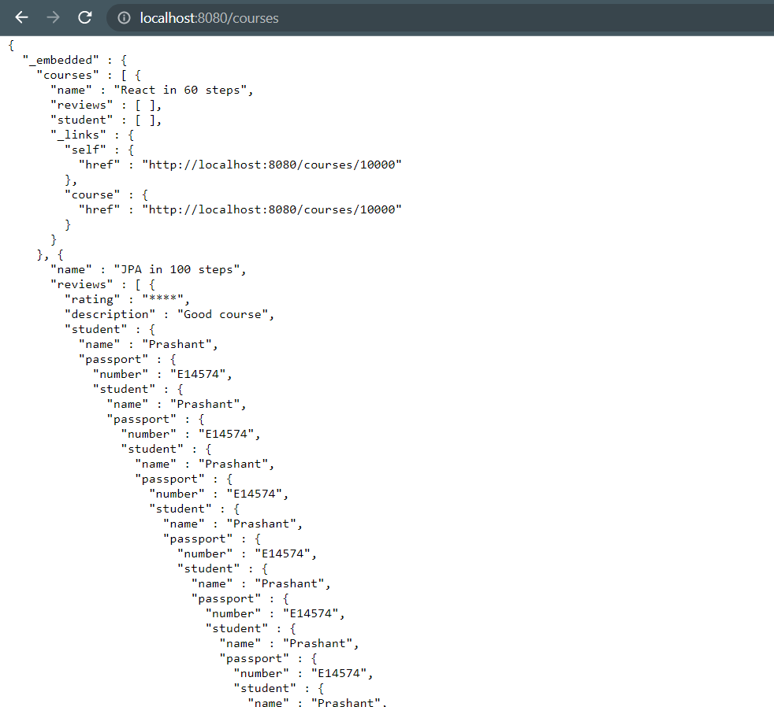

## Spring Data JPA


**Up until now we saw Implementation of JPA as Hibernate**

Now we will see ``JpaRepository``

Create new java interface file ``CourseSpringDataJpaRepository.java``

```java
package com.prashant.jpa.hibernate.JpaHIbernate.repository;

import org.springframework.data.jpa.repository.JpaRepository;

import com.prashant.jpa.hibernate.JpaHIbernate.entity.Course;

public interface CourseSpringDataJpaRepository extends JpaRepository<Course, Long> {

}

```
``JpaRepository`` provides a lot of predefined methods for different db operations

Examples:

```java
@SpringBootTest(classes = JpaHibernateApplication.class)
class CourseSpringDataRepository {
	private Logger logger = LoggerFactory.getLogger(this.getClass());

	@Autowired
	CourseSpringDataJpaRepository repository;
	@Test
	void findById() {
		Optional<Course> course = repository.findById(10001L);
		assertTrue(course.isPresent());
	}
	
	@Test
	void playingAroundWithSpringDataJpaRepository() {
		/*
		 * Course course = repository.save(new Course("Ramayan in 1000 steps"));
		logger.info("Course added to db ->{} ",course);
		course.setName("Krishna lila in 100 steps");
		repository.save(course);*/
		
		logger.info("All courses -> {}",repository.findAll());
		logger.info("All count -> {}",repository.count());

	}
}
```

**How to add sorting to your queries**

```java
// FindAll() sorted courses in descending order
	@Test
	void sort() {
		Sort sort = Sort.by(Direction.DESC, "name");
		logger.info("All sorted course are -> {}", repository.findAll(sort));
		
	}
```
**Pagination Using Spring data JPA**

_Pagination is important, in front-end data optimization. Instead of sending all the data, only let say 5 rows are sent , and upon click of next, next 5 rows are sent. So this basically reduces overhead on the server_

```java
//Pagination using Spring data JPA
	@Test
	void pagination() {
		PageRequest page = PageRequest.of(0, 3); // (0,3)-> 0 index of 1st page of 3 pages 
		Page<Course> firstPage  = repository.findAll(page);
		logger.info("First page -> {}",firstPage.getContent()); // printing first page
		
		Pageable secondPageable  = firstPage.nextPageable();
		Page<Course> page2 = repository.findAll(secondPageable);
		logger.info("second page -> {}",page2.getContent()); // printing second page
		//Similary we can print 3rd page as well
	}
	
```


Custom Queries Using Spring Data JPA
---

Write following in ``CourseSpringDataJpaRepository.java``

```java
public interface CourseSpringDataJpaRepository extends JpaRepository<Course, Long> {
	public interface CourseSpringDataJpaRepository extends JpaRepository<Course, Long> {

	
	//Finding course with specific name eg 'JPA in 100 steps'
	List<Course> findByName(String name);
	
	
	//Finding by name and id
	List<Course> findByNameAndId(String name,Long id);
	
	//count by name
	Long countByName(String name);
	
	//order by name
	List<Course> findByNameOrderByIdDesc(String name);
	
	//courses where name is like "%someting%" ordered by id descending
	List<Course> findByNameLikeOrderByIdDesc(String name);
	
	//delete by name
	List<Course> deleteByName(String name);
	//--------------------------------------------------------
	//@ JPQL query
	@Query("Select c from Course c where c.name like '%100%'")
	List <Course> findByNameLikeJpqlQuery();
	
	//Native sql query
	@Query(value = "select * from course where name like '%100%'",nativeQuery = true)
	List <Course> findByNameLikeNative();
	
}
}

```

Test it using following methods in ``CourseSpringDataRepository.java`` 

```java
	@Test
	void findCourseByName() {
		List<Course> courses = repository.findByName("JPA in 100 steps");
		logger.info("Course -> {}",courses);
	}
	
	@Test
	void countByName() {
		Long course = repository.countByName("Angular in 10 steps");
		logger.info("Courses -> {}",course);
	}
	
	@Test
	void findByNameOrderByIdDesc() {
		List<Course> courses = repository.findByNameLikeOrderByIdDesc("Angular in 10 steps");
		logger.info("Courses ordered by Id in descending ->{}",courses);
	}
	
	@Test
	void findByNameLikeOrderByIdDesc() {
		List<Course> courses = repository.findByNameLikeOrderByIdDesc("%100%");
		logger.info("Courses like '%100%' ordered by Id in descending ->{}",courses);
	}
	
	@Test
	@DirtiesContext
	@Transactional
	void deleteByName() {
		List<Course> courses = repository.deleteByName("Angular in 10 steps");
		logger.info("deleted course are -> {}",courses);
	}
	
	@Test
	void findByNameLikeJpqlQuery() {
		List<Course> courses = repository.findByNameLikeJpqlQuery();
		logger.info("Courses -> {}",courses);
	}
	
	@Test
	void findByNameLikeNativeQuery() {
		List<Course> courses = repository.findByNameLikeNative();
		logger.info("Courses -> {}",courses);
	}
	
```
Spring Data REST
---
We created Spring data JPA by extending ``JpaRepository`` in our ``CourseSpringDataREpository.java`` .

If we want JpaRepository to be exposed to REST endpoints we can use **Spring Data REST**

1 Add following dependencies to your ``pom.xml``

```xml
		<dependency>
			<groupId>org.springframework.boot</groupId>
			<artifactId>spring-boot-starter-data-rest</artifactId>
		</dependency>
```
2 Make ``CourseSpringDataRepository.java`` a Spring data rest repository by adding annotation 

```java
@RepositoryRestResource(path="courses")
public interface CourseSpringDataJpaRepository extends JpaRepository<Course, Long> {...}
```

 So ``CourseSpringDataRepository`` is exposed at ``"/courses"`` URI.

**If we access the** ``course`` **resource at** ``http://localhost:8080/courses`` **we we get infinite JSON response as , course has students , students have reviews, review has students and courses and .....loop :)**



We can avoid this by using ``@JsonIgnore`` annotation on ``students`` field in ``Course.java`` , If you want you can use it to some other fields as well like ``reviews``

****

[Introduction to Caching](https://github.com/prashantRmishra/JpaHibernateLearning/blob/jpa-hibernate-in-depth/IntoductionToCaching.md)
---


